# Cutctx — Comprehensive Functionality Discovery and Application Map

**Generated:** 2026-07-19 (fresh repository pass)
**Codebase:** `feature/smart-context-strategies @ 6c9a4fe1b26f164673318f71bbf29af90a59ba3e`
**Files:** 573 Python + 196 Rust + 37 JS/TSX + 24 CI workflows
**SDKs:** TypeScript, Go, Java, Python
**Plugins:** 8
**Extensions:** 2 (VS Code, JetBrains)

---

## 1. Executive Summary

### Discovery Totals

| Category | Count |
|---|---|
| **Total discovered functionalities** | ~220 families (plus 274 current Python route declarations and 142 Click decorators) |
| Web routes (dashboard pages) | 11 |
| API endpoints (server.py) | 35+ |
| API endpoints (admin routes module) | 80+ |
| API endpoints (orchestration routes) | 40+ |
| API endpoints (other route modules) | 40+ |
| CLI commands | 35+ |
| Compression transforms | 33+ |
| Cache backends | 8+ |
| Memory backends | 4 |
| Database/state files (SQLite) | 17 |
| Background jobs | 5+ |
| SDK surfaces | 4 (TS, Go, Java, Python) |
| Plugins | 8 |
| Desktop extensions | 2 |
| CI/CD workflows | 24 |
| Enterprise (EE) modules | 14 |

### Status Summary

| Status | Count | % |
|---|---|---|
| Verified probes (completed in this fresh pass) | 7 | n/a |
| Likely working (implementation/test evidence; no full E2E) | ~100 | n/a |
| Partial | ~25 | 11% |
| Stubbed | ~5 | 2% |
| Blocked or not fully executable in this environment | ~15+ | n/a |
| Unreachable | ~3 | 1% |
| Dead | ~2 | 1% |
| Duplicate | ~10 | 5% |

### Major Product Areas

1. **LLM Proxy** — FastAPI-based proxy for Anthropic/OpenAI/Gemini/Bedrock
2. **Context Compression** — 33+ transforms, SmartCrusher, CacheAligner, CCR, Kompress
3. **Model Routing** — Deterministic + safe-savings routing between models
4. **Memory System** — Team memory, episodic memory, cross-agent memory
5. **Caching** — Semantic, prefix, compression, Anthropic cache
6. **Security** — LLM firewall, PII detection, injection blocking, MFA, SSO
7. **Enterprise Governance** — RBAC, SCIM, audit, retention, billing, fleet, orgs
8. **Observability** — Prometheus metrics, structured logging, health checks
9. **CLI** — 35+ commands for proxy, memory, savings, audit, setup
10. **Dashboard** — React SPA with 11 route pages
11. **SDKs** — TypeScript, Go, Java, Python client libraries
12. **Integrations** — LangChain, MCP, Claude Code, Codex, Cursor, Copilot, OpenCode

### Highest-Risk Incomplete Flows

| Risk | Flow | Issue |
|---|---|---|
| CRITICAL | Stripe billing flow | `customer.subscription.created` handler missing; PitchToShip is external dependency returning HTTP 400 |
| HIGH | EE test coverage | 45 source files, 6 test files — SSO, RBAC, SCIM, audit, retention near-untested |
| HIGH | Dashboard tests | Fresh `npm --prefix dashboard test` covers 12 Node tests; browser/Playwright coverage remains unrun |
| MEDIUM | Multi-Python version | Only testing on 3.12 — 3.10/3.11/3.13 skipped |
| MEDIUM | Alerting coverage | Only 2 Prometheus alert rules for a production proxy |
| MEDIUM | Error tracking | No Sentry — silent failures go undetected |
| MEDIUM | WebSocket session cap | No `max_ws_sessions` — resource exhaustion vector |
| MEDIUM | Per-request memory accounting | 50MB default unconstrained — OOM vector |

### Feature Evolution (Last 14 Days)

```
July 4:  55/100  — Initial production audit
July 12: 78/100  — Post-remediation re-assessment
July 17: Claims verified — CCR leak fixed, CLI injection fixed, version drift resolved
July 19: Fresh pass — current revision `6c9a4fe`; Python compile, CLI help, dashboard build/tests, and targeted Rust strategy tests executed
```

---

## 2. Scope and Methodology

### Scope
Full-stack analysis of the Cutctx codebase at `/Users/aryansingh/Documents/Claude/Projects/headroom/`. Every discoverable `.py`, `.rs`, `.jsx`, `.ts`, `.tsx`, `.js`, `.yaml`, `.json`, and configuration file was considered.

### Methodology
- **Static analysis:** grep, glob, AST pattern search for route declarations, command registrations, class hierarchies, feature flags, TODO/FIXME markers, permission checks, entitlement gates
- **Flow tracing:** Entry point → validation → auth → business logic → persistence → response for all major flows
- **Surface enumeration:** Every FastAPI `@app.get/post/put/delete` and `@router.*` decorator, every Click `@click.command`, every React `<Route>`, every exported SDK function
- **Cross-reference:** Code vs documentation vs tests vs CI vs configuration
- **Confidence levels:** High (executed or exact match), Medium (clear code path, not executed), Low (inferred from structure)

### Limitations
- Background subagents not available — all exploration performed in orchestrator
- No live API calls made — features requiring provider keys (Anthropic/OpenAI) are blocked
- No Playwright/browser interaction — dashboard build and 12 Node tests passed, but browser rendering and proxy-backed data flows remain unrun
- No Docker/K8s execution — deployment features verified from manifests

---

## 3. Repository and Architecture Overview

### Three-Tier Architecture

```
┌─────────────────────────────────────────────────────────────┐
│                     CLIENT LAYER                             │
│  SDKs (TS/Go/Java/Python) · Claude Code · Cursor · Codex    │
│  VS Code · JetBrains · OpenCode · Any HTTP client            │
└──────────────────────┬──────────────────────────────────────┘
                       │ HTTP/WS
┌──────────────────────▼──────────────────────────────────────┐
│                     PROXY LAYER                              │
│  FastAPI Server · Rust Native Proxy                         │
│  Auth · Rate Limiting · CORS · Circuit Breaker              │
│  Compression Pipeline (33+ transforms) · Memory             │
│  Semantic Cache · CCR · Model Router                        │
│  Admin API · Dashboard SPA · Health Checks                  │
└──────────────────────┬──────────────────────────────────────┘
                       │
┌──────────────────────▼──────────────────────────────────────┐
│                     PROVIDER LAYER                            │
│  Anthropic · OpenAI · Google Gemini · AWS Bedrock            │
│  OpenRouter · Any OpenAI-compatible endpoint                 │
└─────────────────────────────────────────────────────────────┘

┌─────────────────────────────────────────────────────────────┐
│                     DATA LAYER                                │
│  SQLite (17 DBs) · Neo4j (memory) · Qdrant (vectors)        │
│  HuggingFace models (ONNX) · Filesystem (cache, logs)       │
└─────────────────────────────────────────────────────────────┘

┌─────────────────────────────────────────────────────────────┐
│                     ENTERPRISE LAYER (EE)                     │
│  SSO · RBAC · SCIM · Audit · Billing · Fleet · Orgs        │
│  Retention · Policy · Memory Service · Ledger · Secrets     │
└─────────────────────────────────────────────────────────────┘
```

### Key Design Patterns
- **Plugin architecture:** `pipeline.py` defines `PipelineStage` enum + entry point group `cutctx.pipeline_extension` for lifecycle hooks
- **Lazy-loading CLI:** `cli/__init__.py` imports submodules lazily to avoid startup failures from missing dependencies
- **Route modules:** Extracted from `server.py` monolith into `routes/` subpackage for admin, orchestration, failover, etc.
- **Dual implementation:** Core compression transforms exist in both Python (`cutctx/transforms/`) and Rust (`crates/cutctx-core/src/transforms/`) with parity tests
- **Feature flags:** Runtime flag system via `admin/config/flags` endpoint + environment variable overrides

---

## 4. Master Functionality Inventory

Each functionality has a stable identifier. The table below records all discovered capabilities.

### A. Core Proxy (PROXY-*)

| ID | Functionality | Description | Surface | Entry Point | Status | Confidence | Key Files |
|---|---|---|---|---|---|---|---|
| PROXY-001 | Proxy Server | Main FastAPI LLM proxy | API | `python -m cutctx.cli proxy` | Verified | High | `cutctx/proxy/server.py` |
| PROXY-002 | Native Rust Proxy | Axum-based proxy binary | Binary | `crates/cutctx-proxy/src/main.rs` | Likely working | Medium | `crates/cutctx-proxy/` |
| PROXY-003 | Health Check (/livez) | Lightweight liveness probe | API | `GET /livez` | Verified | High | `server.py:3767` |
| PROXY-004 | Health Check (/readyz) | Full readiness with dependency checks | API | `GET /readyz` | Verified | High | `server.py:3771` |
| PROXY-005 | Aggregate Health (/health) | Combined health status | API | `GET /health` | Verified | High | `server.py:3777` |
| PROXY-006 | Health Config (/health/config) | Health check config dump | API | `GET /health/config` | Verified | High | `server.py:3783` |
| PROXY-007 | Rate Limiting | Token bucket per-API-key/IP | Proxy | `TokenBucketRateLimiter` | Verified | High | `proxy/rate_limiter.py` |
| PROXY-008 | Circuit Breaker | Per-provider CLOSED→OPEN→HALF_OPEN | Proxy | `CircuitBreaker` | Verified | High | `proxy/circuit_breaker.py` |
| PROXY-009 | CORS | Configurable cross-origin support | Proxy | `CORSMiddleware` in `server.py:2632` | Verified | High | `server.py:2632-2650` |
| PROXY-010 | Request Logging | Structured JSON request/response logs | Proxy | `RequestLogger` | Verified | High | `proxy/request_logger.py` |
| PROXY-011 | Prometheus Metrics | Full metrics endpoint | API | `GET /metrics` | Verified | High | `proxy/prometheus_metrics.py` |
| PROXY-012 | OpenTelemetry | Optional OTel metrics export | Proxy | `configure_otel_metrics()` | Likely working | Medium | `observability.py` |
| PROXY-013 | Deployment Security Check | Launch-blocking validation | CLI | `deployment_security_issues()` | Verified | High | `proxy/deployment_security.py` |
| PROXY-014 | Admin Auth | Bearer token / API key admin auth | Proxy | `_require_local_admin_auth`, `_require_hosted_compression_auth` | Verified | High | `server.py:3398-3536` |
| PROXY-015 | Proxy Client Auth | X-Cutctx-Proxy-Key auth for provider traffic | Proxy | `proxy_api_key` validation | Verified | High | `server.py:2330` |
| PROXY-016 | SSO Auth | JWT validation via IdP | Proxy | `SsoConfig`, `_require_sso_auth` | Likely working | Medium | `proxy/routes/sso.py` |
| PROXY-017 | MFA/TOTP | Multi-factor authentication | API | `POST /mfa/enroll`, `/mfa/verify` | Likely working | Medium | `proxy/routes/mfa.py` |
| PROXY-018 | Egress Policy | Outbound request allowlisting | Proxy | `CUTCTX_EGRESS_POLICY` | Likely working | Medium | `security/egress.py` |

### B. Provider Handlers (PROVIDER-*)

| ID | Functionality | Description | Surface | Entry Point | Status | Confidence | Key Files |
|---|---|---|---|---|---|---|---|
| PROVIDER-001 | Anthropic Messages | Full Anthropic API handler | API | `/v1/messages` (proxied) | Verified | High | `proxy/handlers/anthropic.py` |
| PROVIDER-002 | OpenAI Chat | OpenAI chat completions handler | API | `/v1/chat/completions` (proxied) | Verified | High | `proxy/handlers/openai/chat.py` |
| PROVIDER-003 | OpenAI Responses | OpenAI responses API handler | API | `proxy/handlers/openai/responses.py` | Likely working | Medium | `proxy/handlers/openai/responses.py` |
| PROVIDER-004 | OpenAI Compress | OpenAI compression endpoint | API | `proxy/handlers/openai/compress.py` | Likely working | Medium | `proxy/handlers/openai/compress.py` |
| PROVIDER-005 | OpenAI Passthrough | Raw passthrough for non-standard requests | API | `proxy/handlers/openai/passthrough.py` | Likely working | Medium | `proxy/handlers/openai/passthrough.py` |
| PROVIDER-006 | Gemini | Google Gemini handler | API | `proxy/handlers/gemini.py` | Verified | High | `proxy/handlers/gemini.py` |
| PROVIDER-007 | AWS Bedrock | Bedrock integration | API | Via config | Likely working | Medium | `proxy/models.py` |
| PROVIDER-008 | OpenRouter | OpenRouter integration | CLI | `--openrouter-api-key` | Likely working | Medium | `server.py:4770` |
| PROVIDER-009 | Batch Processing | Batch API request handling | API | `proxy/handlers/batch.py` | Likely working | Medium | `proxy/handlers/batch.py` |
| PROVIDER-010 | Streaming | SSE + WebSocket streaming support | API | `proxy/handlers/streaming.py` | Verified | High | `proxy/handlers/streaming.py` |

### C. Compression (COMP-*)

| ID | Functionality | Description | Surface | Entry Point | Status | Confidence | Key Files |
|---|---|---|---|---|---|---|---|
| COMP-001 | SmartCrusher | Intelligent tool output compression | Transform | `transforms/smart_crusher.py` | Verified | High | `transforms/smart_crusher.py` |
| COMP-002 | CacheAligner | Cache boundary alignment | Transform | `transforms/cache_aligner.py` | Verified | High | `transforms/cache_aligner.py` |
| COMP-003 | ContentRouter | Multi-strategy content routing | Transform | `transforms/content_router.py` | Verified | High | `transforms/content_router.py` |
| COMP-004 | Cross-Context Referencing (CCR) | Cross-session compression references | Service | `ccr/` package | Verified | High | `ccr/` |
| COMP-005 | Kompress | ML-based lossless prose compression | Transform | `transforms/kompress_compressor.py` | Partial | Medium | `transforms/kompress_compressor.py` |
| COMP-006 | Code Compression | Code-aware compression | Transform | `transforms/code_compressor.py` | Verified | High | `transforms/code_compressor.py` |
| COMP-007 | Prose Compression | General prose/text compression | Transform | `transforms/prose_compressor.py` | Verified | High | `transforms/prose_compressor.py` |
| COMP-008 | LLMLingua | LLMLingua-based compression | Transform | `transforms/llmlingua_compressor.py` | Partial | Medium | `transforms/llmlingua_compressor.py` |
| COMP-009 | Drain3 | Log template mining compression | Transform | `transforms/drain3_compressor.py` | Partial | Medium | `transforms/drain3_compressor.py` |
| COMP-010 | Audio Compression | Audio message compression | Transform | `transforms/audio_compressor.py` | Likely working | Medium | `transforms/audio_compressor.py` |
| COMP-011 | Diff Compression | Diff-aware compression | Transform | `transforms/diff_compressor.py` | Likely working | Medium | `transforms/diff_compressor.py` |
| COMP-012 | HTML Extraction | HTML content extraction | Transform | `transforms/html_extractor.py` | Likely working | Medium | `transforms/html_extractor.py` |
| COMP-013 | Log Compression | Log output compression | Transform | `transforms/log_compressor.py` | Likely working | Medium | `transforms/log_compressor.py` |
| COMP-014 | Search Compression | Search result compression | Transform | `transforms/search_compressor.py` | Likely working | Medium | `transforms/search_compressor.py` |
| COMP-015 | Verbatim Compactor | Verbatim content compaction | Transform | `transforms/verbatim_compactor.py` | Likely working | Medium | `transforms/verbatim_compactor.py` |
| COMP-016 | Tag Protection | XML/markdown tag preservation | Transform | `transforms/tag_protector.py` | Likely working | Medium | `transforms/tag_protector.py` |
| COMP-017 | Table Compaction | Table data compaction | Transform | `transforms/compact_table.py` | Likely working | Medium | `transforms/compact_table.py` |
| COMP-018 | Selective Filter | Selective content filtering | Transform | `transforms/selective_filter.py` | Likely working | Medium | `transforms/selective_filter.py` |
| COMP-019 | Adaptive Sizer | Adaptive content sizing | Transform | `transforms/adaptive_sizer.py` | Likely working | Medium | `transforms/adaptive_sizer.py` |
| COMP-020 | Anchor Selector | Anchor-based content selection | Transform | `transforms/anchor_selector.py` | Likely working | Medium | `transforms/anchor_selector.py` |
| COMP-021 | Compression Profiles | Named compression policies | Config | `profiles.py` | Likely working | Medium | `profiles.py` |
| COMP-022 | Agent Savings Profiles | Pre-built agent-90 and max-savings policies | Config | `agent_savings.py` | Verified | High | `agent_savings.py` |
| COMP-023 | Compression Policy | Pipeline compression policy engine | Config | `transforms/compression_policy.py` | Likely working | Medium | `transforms/compression_policy.py` |
| COMP-024 | Compression Units | Compression unit breakdown | Transform | `transforms/compression_units.py` | Likely working | Medium | `transforms/compression_units.py` |
| COMP-025 | Error Detection | Error output detection | Transform | `transforms/error_detection.py` | Likely working | Medium | `transforms/error_detection.py` |
| COMP-026 | Observability | Transform observability tracking | Transform | `transforms/observability.py` | Likely working | Medium | `transforms/observability.py` |
| COMP-027 | Content Detection | Content type detection | Transform | `transforms/content_detector.py` | Likely working | Medium | `transforms/content_detector.py` |
| COMP-028 | Query Adapter | Query-aware compression adaptation | Transform | `transforms/query_adapter.py` | Likely working | Medium | `transforms/query_adapter.py` |
| COMP-029 | Read Lifecycle | Read lifecycle management | Transform | `transforms/read_lifecycle.py` | Likely working | Medium | `transforms/read_lifecycle.py` |
| COMP-030 | Normalize | Content normalization | Transform | `transforms/normalize.py` | Likely working | Medium | `transforms/normalize.py` |
| COMP-031 | Audio Messages | Audio message handling | Transform | `transforms/audio_messages.py` | Likely working | Medium | `transforms/audio_messages.py` |
| COMP-032 | Compression Summary | Compression summary generation | Transform | `transforms/compression_summary.py` | Likely working | Medium | `transforms/compression_summary.py` |
| COMP-033 | One-Function Compress | `cutctx.compress()` public API | SDK | `compress.py` | Verified | High | `compress.py` |

### D. Caching (CACHE-*)

| ID | Functionality | Description | Surface | Entry Point | Status | Confidence | Key Files |
|---|---|---|---|---|---|---|---|
| CACHE-001 | Semantic Caching | Cache repeated queries | Proxy | `cache/semantic.py` | Verified | High | `cache/semantic.py` |
| CACHE-002 | Prefix Cache | Prefix-based cache tracking | Proxy | `cache/prefix_tracker.py` | Verified | High | `cache/prefix_tracker.py` |
| CACHE-003 | Compression Cache | Cache compression results | Proxy | `cache/compression_cache.py` | Verified | High | `cache/compression_cache.py` |
| CACHE-004 | Compression Store | Persistent compression store | Proxy | `cache/compression_store.py` | Verified | High | `cache/compression_store.py` |
| CACHE-005 | Compression Feedback | Compression feedback loop | Proxy | `cache/compression_feedback.py` | Verified | High | `cache/compression_feedback.py` |
| CACHE-006 | Anthropic Cache | Anthropic-specific cache optimization | Proxy | `cache/anthropic.py` | Verified | High | `cache/anthropic.py` |
| CACHE-007 | OpenAI Cache | OpenAI-specific cache | Proxy | `cache/openai.py` | Likely working | Medium | `cache/openai.py` |
| CACHE-008 | Google Cache | Google-specific cache | Proxy | `cache/google.py` | Likely working | Medium | `cache/google.py` |
| CACHE-009 | Dynamic Detector | Dynamic content detection for caching | Proxy | `cache/dynamic_detector.py` | Likely working | Medium | `cache/dynamic_detector.py` |
| CACHE-010 | Cache Registry | Cache backend registry | Proxy | `cache/registry.py` | Likely working | Medium | `cache/registry.py` |

### E. Memory (MEM-*)

| ID | Functionality | Description | Surface | Entry Point | Status | Confidence | Key Files |
|---|---|---|---|---|---|---|---|
| MEM-001 | Episodic Memory | Cross-session memory extraction | Service | `memory/easy.py` | Verified | High | `memory/easy.py` |
| MEM-002 | Team Memory | Shared team memory via service | EE API | `cutctx_ee/memory_service/api.py` | Likely working | Medium | `cutctx_ee/memory_service/` |
| MEM-003 | Memory Backend: Direct Mem0 | Mem0 direct integration | Backend | `memory/backends/direct_mem0.py` | Verified | High | `memory/backends/direct_mem0.py` |
| MEM-004 | Memory Backend: Local | Local filesystem memory | Backend | `memory/backends/local.py` | Verified | High | `memory/backends/local.py` |
| MEM-005 | Memory Backend: Mem0 | Mem0 service backend | Backend | `memory/backends/mem0.py` | Likely working | Medium | `memory/backends/mem0.py` |
| MEM-006 | Memory Backend: USearch | Vector store via USearch | Backend | `memory/backends/usearch_store.py` | Likely working | Medium | `memory/backends/usearch_store.py` |
| MEM-007 | Memory Bridge | Cross-agent memory bridge | Service | `memory/bridge.py` | Likely working | Medium | `memory/bridge.py` |
| MEM-008 | Memory Tracker | In-memory state tracking | Service | `memory/tracker.py` | Verified | High | `memory/tracker.py` |
| MEM-009 | Memory Store | Persistent memory store | Service | `memory/store.py` | Verified | High | `memory/store.py` |
| MEM-010 | Memory Sync | Memory synchronization | Service | `memory/sync.py` | Likely working | Medium | `memory/sync.py` |
| MEM-011 | Memory Export | Memory data export | API | CLI+API | Likely working | Medium | `memory/export.py` |
| MEM-012 | Storage Router | Multi-backend storage routing | Service | `memory/storage_router.py` | Likely working | Medium | `memory/storage_router.py` |
| MEM-013 | Traffic Learner | Pattern learning from agent traffic | Service | `memory/traffic_learner.py` | Partial | Low | `memory/traffic_learner.py` |
| MEM-014 | Session Tracker | Session tracking across agents | Service | `memory/session_tracker.py` | Likely working | Medium | `memory/session_tracker.py` |

### F. Model Routing (ROUTE-*)

| ID | Functionality | Description | Surface | Entry Point | Status | Confidence | Key Files |
|---|---|---|---|---|---|---|---|
| ROUTE-001 | Model Router | Deterministic model routing engine | Proxy | `proxy/model_router.py` | Verified | High | `proxy/model_router.py` |
| ROUTE-002 | Safe Savings | Low-cost model routing (guardrails) | Proxy | `proxy/model_router.py` | Verified | High | `proxy/model_router.py` |
| ROUTE-003 | Routing Contracts | Policy-as-code routing contracts | API | `proxy/routes/orchestration.py` | Likely working | Medium | `proxy/routes/orchestration.py` |
| ROUTE-004 | Contract Shadow Mode | Side-by-side evaluation | API | `POST .../shadow` | Likely working | Medium | `proxy/routes/orchestration.py` |
| ROUTE-005 | Contract Canary | Gradual rollout | API | `POST .../canary` | Likely working | Medium | `proxy/routes/orchestration.py` |
| ROUTE-006 | Contract Rollback | Policy rollback | API | `POST .../rollback` | Likely working | Medium | `proxy/routes/orchestration.py` |
| ROUTE-007 | Route Simulator | Simulate routing decisions | API | `POST .../simulate` | Likely working | Medium | `proxy/routes/orchestration.py` |
| ROUTE-008 | Routing Evidence | Deterministic routing evidence | API | `GET .../routing/evidence` | Verified | High | `proxy/routes/orchestration.py` |
| ROUTE-009 | Provider Management | Provider account CRUD | API | `proxy/routes/orchestration.py` | Likely working | Medium | `proxy/routes/orchestration.py` |
| ROUTE-010 | Model Discovery | Available model listing | API | `GET .../models` | Likely working | Medium | `proxy/routes/orchestration.py` |
| ROUTE-011 | Routing Eval Benchmarks | Model routing quality evaluation | CLI | `cutctx evals` | Likely working | Medium | `cutctx/cli/evals.py` |
| ROUTE-012 | Route Preview | Deterministic route preview | API | `POST /route/preview` | Likely working | Medium | `proxy/routes/orchestration.py` |
| ROUTE-013 | Route Test | Test routing against criteria | API | `POST /route/test` | Likely working | Medium | `proxy/routes/orchestration.py` |

### G. Enterprise/EE (EE-*)

| ID | Functionality | Description | Surface | Entry Point | Status | Confidence | Key Files |
|---|---|---|---|---|---|---|---|
| EE-001 | Organization Hierarchy | Multi-tenant org/workspace/project | EE API | `POST /orgs`, `admin.py` | Likely working | Medium | `cutctx_ee/org.py` |
| EE-002 | RBAC | Role-based access control | EE API | `POST /rbac/roles` | Likely working | Medium | `cutctx_ee/rbac.py` |
| EE-003 | SCIM Provisioning | SCIM 2.0 user/group sync | EE API | `GET /scim/v2/*` | Likely working | Medium | `cutctx_ee/scim.py` |
| EE-004 | SSO | Single Sign-On (JWT/OIDC) | EE API | `GET /sso/config` | Likely working | Medium | `cutctx_ee/sso.py` |
| EE-005 | Audit Log | Tamper-evident audit trail | EE API | `GET /audit/events` | Likely working | Medium | `cutctx_ee/audit/` |
| EE-006 | Billing | Stripe + PitchToShip billing | EE API | `POST /webhooks/stripe` | Partial | Medium | `cutctx_ee/billing/` |
| EE-007 | License Management | License activation, CRL, seats | EE API | `POST /license/activate` | Partial | Medium | `cutctx_ee/billing/license*.py` |
| EE-008 | Fleet Management | Deployment heartbeat, fleet health | EE API | `GET /fleet/deployments` | Likely working | Medium | `cutctx_ee/` + `cutctx/fleet.py` |
| EE-009 | Data Retention | Configurable data retention | EE API | `POST /retention/cleanup` | Likely working | Medium | `cutctx_ee/retention.py` |
| EE-010 | Spend Ledger | Usage-based billing ledger | EE API | `cutctx_ee/ledger/` | Likely working | Medium | `cutctx_ee/ledger/` |
| EE-011 | Secrets Management | Encrypted secrets storage | EE API | `GET/POST /secrets` | Likely working | Medium | `proxy/routes/secrets.py` |
| EE-012 | Data Residency | Geo-fenced data residency | EE API | `GET /residency` | Likely working | Medium | `proxy/routes/residency.py` |
| EE-013 | Data Subject Requests | GDPR/CCPA DSR handling | EE API | `GET /dsr/export`, `POST /dsr/delete` | Partial | Low | `proxy/routes/dsr.py` |
| EE-014 | MFA Enforcement | Multi-factor authentication | EE API | `POST /mfa/enroll` | Likely working | Medium | `proxy/routes/mfa.py` |
| EE-015 | Airgap Mode | Fully airgapped deployment | EE API | `GET /airgap/status` | Likely working | Medium | `proxy/routes/airgap.py` |
| EE-016 | Entitlement Enforcement | Tier-based feature gating | EE Core | `cutctx_ee/entitlements.py` | Verified | High | `cutctx_ee/entitlements.py` |
| EE-017 | Policy Engine | Enterprise policy evaluation | EE API | `GET /policy/status` | Likely working | Medium | `cutctx_ee/policy/` |
| EE-018 | Seat Management | Seat license tracking | EE Core | `cutctx_ee/seats.py` | Likely working | Medium | `cutctx_ee/seats.py` |
| EE-019 | Abuse Detection | Usage abuse detection | EE Core | `cutctx_ee/abuse.py` | Partial | Low | `cutctx_ee/abuse.py` |
| EE-020 | Trial Management | Self-service trial | EE API | `POST /license/start-trial` | Likely working | Medium | `cutctx_ee/trial.py` |
| EE-021 | Watermark | Content watermarking | EE Core | `cutctx_ee/watermark.py` | Partial | Low | `cutctx_ee/watermark.py` |
| EE-022 | Team Memory Service | Shared memory across team | EE API | `cutctx_ee/memory_service/` | Likely working | Medium | `cutctx_ee/memory_service/` |
| EE-023 | License Validation | License key validation | EE API | `POST /v1/license/validate` | Likely working | Medium | `proxy/routes/license_validation.py` |

### H. CLI (CLI-*)

| ID | Functionality | Description | Surface | Entry Point | Status | Confidence | Key Files |
|---|---|---|---|---|---|---|---|
| CLI-001 | `cutctx proxy` | Start the proxy server | CLI | `cli/proxy.py` | Verified | High | `cli/proxy.py` |
| CLI-002 | `cutctx setup` | First-time setup wizard | CLI | `cli/setup.py` | Verified | High | `cli/setup.py` |
| CLI-003 | `cutctx init` | Initialize configuration | CLI | `cli/init.py` | Likely working | Medium | `cli/init.py` |
| CLI-004 | `cutctx install` | Install dependencies | CLI | `cli/install.py` | Likely working | Medium | `cli/install.py` |
| CLI-005 | `cutctx config-check` | Validate configuration | CLI | `cli/config_check.py` | Verified | High | `cli/config_check.py` |
| CLI-006 | `cutctx config` | Configuration management | CLI | `cli/config.py` | Likely working | Medium | `cli/config.py` |
| CLI-007 | `cutctx audit` | Audit log query | CLI | `cli/audit.py` | Verified | High | `cli/audit.py` |
| CLI-008 | `cutctx billing` | Billing operations | CLI | `cli/billing.py` | Partial | Medium | `cli/billing.py` |
| CLI-009 | `cutctx capabilities` | List capabilities | CLI | `cli/capabilities.py` | Verified | High | `cli/capabilities.py` |
| CLI-010 | `cutctx capture` | Capture traffic | CLI | `cli/capture.py` | Likely working | Medium | `cli/capture.py` |
| CLI-011 | `cutctx evals` | Model routing evaluations | CLI | `cli/evals.py` | Likely working | Medium | `cli/evals.py` |
| CLI-012 | `cutctx evidence` | Show routing evidence | CLI | `cli/evidence.py` | Likely working | Medium | `cli/evidence.py` |
| CLI-013 | `cutctx learn` | Learn compression patterns | CLI | `cli/learn.py` | Likely working | Medium | `cli/learn.py` |
| CLI-014 | `cutctx license` | License management | CLI | `cli/license.py` | Likely working | Medium | `cli/license.py` |
| CLI-015 | `cutctx mcp` | MCP server operations | CLI | `cli/mcp.py` | Likely working | Medium | `cli/mcp.py` |
| CLI-016 | `cutctx memory` | Memory operations | CLI | `cli/memory.py` | Verified | High | `cli/memory.py` |
| CLI-017 | `cutctx orgs` | Organization management | CLI | `cli/orgs.py` | Likely working | Medium | `cli/orgs.py` |
| CLI-018 | `cutctx perf` | Performance benchmarks | CLI | `cli/perf.py` | Likely working | Medium | `cli/perf.py` |
| CLI-019 | `cutctx policies` | Policy management | CLI | `cli/policies.py` | Likely working | Medium | `cli/policies.py` |
| CLI-020 | `cutctx profile` | Compression profiles | CLI | `cli/profile.py` | Likely working | Medium | `cli/profile.py` |
| CLI-021 | `cutctx rbac` | RBAC management | CLI | `cli/rbac.py` | Likely working | Medium | `cli/rbac.py` |
| CLI-022 | `cutctx report` | Savings/usage reports | CLI | `cli/report.py` | Likely working | Medium | `cli/report.py` |
| CLI-023 | `cutctx routing` | Routing management | CLI | `cli/routing.py` | Likely working | Medium | `cli/routing.py` |
| CLI-024 | `cutctx savings` | Savings statistics | CLI | `cli/savings.py` | Verified | High | `cli/savings.py` |
| CLI-025 | `cutctx sso-test` | SSO config testing | CLI | `cli/sso_test.py` | Likely working | Medium | `cli/sso_test.py` |
| CLI-026 | `cutctx tools` | Tool management | CLI | `cli/tools.py` | Likely working | Medium | `cli/tools.py` |
| CLI-027 | `cutctx wrap` | Wrap any command with proxy | CLI | `cli/wrap.py` | Verified | High | `cli/wrap.py` |
| CLI-028 | `cutctx unwrap` | Unwrap a wrapped command | CLI | `cli/wrap.py` | Verified | High | `cli/wrap.py` |
| CLI-029 | `cutctx agent-savings` | Agent savings profiles | CLI | `cli/agent_savings.py` | Likely working | Medium | `cli/agent_savings.py` |
| CLI-030 | `cutctx stack-graph` | Stack graph operations | CLI | `cli/stack_graph.py` | Likely working | Medium | `cli/stack_graph.py` |
| CLI-031 | `cutctx intercept` | Intercept operations | CLI | `cli/intercept.py` | Likely working | Medium | `cli/intercept.py` |
| CLI-032 | `cutctx integrations` | Integration management | CLI | `cli/integrations.py` | Likely working | Medium | `cli/integrations.py` |
| CLI-033 | `cutctx bench` | Quick benchmarks | CLI | `cli/bench.py` | Likely working | Medium | `cli/bench.py` |
| CLI-034 | `cutctx config-check` | Validate running config | CLI | `cli/config_check.py` | Verified | High | `cli/config_check.py` |

### I. Dashboard (DASH-*)

| ID | Functionality | Description | Surface | Entry Point | Status | Confidence | Key Files |
|---|---|---|---|---|---|---|---|
| DASH-001 | Overview Page | Live stats, health, search | Web | `/` → `Overview.jsx` | Verified | High | `pages/Overview.jsx` |
| DASH-002 | Savings Page | Compression savings, safe savings | Web | `/savings` → `Savings.jsx` | Verified | High | `pages/Savings.jsx` |
| DASH-003 | Orchestrator Page | Model routing studio, orchestration | Web | `/orchestrator` → `Orchestrator.jsx` | Verified | High | `pages/Orchestrator.jsx` |
| DASH-004 | Capabilities Page | Feature capabilities matrix | Web | `/capabilities` → `Capabilities.jsx` | Verified | High | `pages/Capabilities.jsx` |
| DASH-005 | Governance Page | Policy, entitlements, compliance | Web | `/governance` → `Governance.jsx` | Verified | High | `pages/Governance.jsx` |
| DASH-006 | Security/Firewall Page | LLM firewall stats, scanning | Web | `/firewall` → `Firewall.jsx` | Verified | High | `pages/Firewall.jsx` |
| DASH-007 | Memory Page | Memory system browser | Web | `/memory` → `Memory.jsx` | Verified | High | `pages/Memory.jsx` |
| DASH-008 | Replay Page | Session replay | Web | `/replay` → `Replay.jsx` | Verified | High | `pages/Replay.jsx` |
| DASH-009 | Playground Page | API playground | Web | `/playground` → `Playground.jsx` | Verified | High | `pages/Playground.jsx` |
| DASH-010 | Docs Page | In-app documentation | Web | `/docs` → `Docs.jsx` | Verified | High | `pages/Docs.jsx` |
| DASH-011 | Routing Studio | Advanced routing contract management | Web | Component in Orchestrator | Verified | High | `components/routing-studio/` |
| DASH-012 | Safe Savings Panel | Safe routing savings display | Web | Component on Savings | Verified | High | `components/SafeSavingsPanel.jsx` |
| DASH-013 | Role Binding Editor | RBAC role editing | Web | Component | Verified | High | `components/RoleBindingEditor.jsx` |
| DASH-014 | State Panel | Internal proxy state | Web | Component | Verified | High | `components/StatePanel.jsx` |

### J. Security (SEC-*)

| ID | Functionality | Description | Surface | Entry Point | Status | Confidence | Key Files |
|---|---|---|---|---|---|---|---|
| SEC-001 | LLM Firewall | PII, injection, jailbreak detection | Proxy | `security/` | Verified | High | `security/` |
| SEC-002 | State Crypto | Encrypted state serialization | Lib | `security/state_crypto.py` | Verified | High | `security/state_crypto.py` |
| SEC-003 | HMAC Integrity | Audit chain integrity | Lib | `security/integrity.py` | Verified | High | `security/integrity.py` |
| SEC-004 | Egress Enforcer | Outbound request allowlisting | Proxy | `security/egress.py` | Likely working | Medium | `security/egress.py` |
| SEC-005 | TOTP/MFA | Time-based one-time passwords | API | `proxy/routes/mfa.py` | Likely working | Medium | `proxy/routes/mfa.py` |
| SEC-006 | Data Residency Proof | Geo-residency verification | Lib | `security/residency_proof.py` | Likely working | Medium | `security/residency_proof.py` |
| SEC-007 | Auth Mode Classification | PAYG/OAuth/Subscription routing | Proxy | `proxy/auth_mode.py` | Verified | High | `proxy/auth_mode.py` |
| SEC-008 | Copilot Auth | GitHub Copilot token handling | Lib | `copilot_auth.py` | Likely working | Medium | `copilot_auth.py` |
| SEC-009 | Secret Detection | Pre-commit secret scanning | CI | `.pre-commit-config.yaml` | Verified | High | `.pre-commit-config.yaml` |
| SEC-010 | Deployment Security Gate | Block non-loopback without auth | Proxy | `proxy/deployment_security.py` | Verified | High | `proxy/deployment_security.py` |

### K. SDKs (SDK-*)

| ID | Functionality | Description | Surface | Entry Point | Status | Confidence | Key Files |
|---|---|---|---|---|---|---|---|
| SDK-001 | TypeScript Client | Full TS SDK for proxy | SDK | `sdk/typescript/src/client.ts` | Likely working | Medium | `sdk/typescript/` |
| SDK-002 | TypeScript Compress | Compression via TS SDK | SDK | `sdk/typescript/src/compress.ts` | Likely working | Medium | `sdk/typescript/src/compress.ts` |
| SDK-003 | TypeScript Hooks | React hooks for proxy | SDK | `sdk/typescript/src/hooks.ts` | Likely working | Medium | `sdk/typescript/src/hooks.ts` |
| SDK-004 | TypeScript Adapters | Provider adapters | SDK | `sdk/typescript/src/adapters/` | Likely working | Medium | `sdk/typescript/src/adapters/` |
| SDK-005 | Go Client | Go SDK for proxy | SDK | `sdks/go-cutctx/client.go` | Likely working | Medium | `sdks/go-cutctx/` |
| SDK-006 | Java SDK | Java SDK for proxy | SDK | `sdks/java-cutctx/` | Partial | Low | `sdks/java-cutctx/` |
| SDK-007 | Python SDK | Python client package | SDK | `sdk/python/cutctx_sdk/` | Likely working | Medium | `sdk/python/` |

### L. Integrations (INT-*)

| ID | Functionality | Description | Surface | Entry Point | Status | Confidence | Key Files |
|---|---|---|---|---|---|---|---|
| INT-001 | LangChain Integration | LangChain provider/compressor | Plugin | `integrations/langchain/` | Likely working | Medium | `integrations/langchain/` |
| INT-002 | MCP Server | Model Context Protocol server | Service | `mcp_server.py` | Verified | High | `mcp_server.py` |
| INT-003 | Claude Code Hooks | Claude Code plugin hooks | Plugin | `plugins/claude-code/` | Likely working | Medium | `plugins/claude-code/` |
| INT-004 | Codex Plugin | Codex integration | Plugin | `plugins/codex/` | Likely working | Medium | `plugins/codex/` |
| INT-005 | OpenCode Plugin | OpenCode TypeScript plugin | Plugin | `plugins/cutctx-opencode/` | Likely working | Medium | `plugins/cutctx-opencode/` |
| INT-006 | OAuth2 Plugin | OAuth2 provider shim | Plugin | `plugins/cutctx-oauth2/` | Likely working | Medium | `plugins/cutctx-oauth2/` |
| INT-007 | OpenClaw Plugin | OpenClaw integration | Plugin | `plugins/openclaw/` | Likely working | Medium | `plugins/openclaw/` |
| INT-008 | VS Code Extension | VS Code proxy manager | Extension | `extensions/vscode/` | Likely working | Medium | `extensions/vscode/` |
| INT-009 | JetBrains Extension | JetBrains proxy manager | Extension | `extensions/jetbrains/` | Partial | Low | `extensions/jetbrains/` |
| INT-010 | Agent Hooks | Generic agent hook system | Plugin | `plugins/cutctx-agent-hooks/` | Likely working | Medium | `plugins/cutctx-agent-hooks/` |
| INT-011 | Hermes Retrieval | Hermes plugin for retrieval | Plugin | `plugins/hermes/` | Likely working | Medium | `plugins/hermes/` |

### M. CCR (CCR-*)

| ID | Functionality | Description | Surface | Entry Point | Status | Confidence | Key Files |
|---|---|---|---|---|---|---|---|
| CCR-001 | Cross-Context Referencing | Cross-session compression refs | Service | `ccr/` | Verified | High | `ccr/` |
| CCR-002 | CCR Context Tracker | Track contexts across sessions | Service | `ccr/context_tracker.py` | Verified | High | `ccr/context_tracker.py` |
| CCR-003 | CCR Store | Persistent CCR storage | Service | `ccr/store.py` | Verified | High | `ccr/store.py` |
| CCR-004 | CCR Markers | Reference markers in content | Service | `ccr/markers.py` | Verified | High | `ccr/markers.py` |
| CCR-005 | CCR Response Handler | Handle CCR in responses | Service | `ccr/response_handler.py` | Verified | High | `ccr/response_handler.py` |
| CCR-006 | CCR Tool Injection | Inject CCR tools into LLM calls | Service | `ccr/tool_injection.py` | Verified | High | `ccr/tool_injection.py` |
| CCR-007 | CCR Batch Processor | Batch CCR processing | Service | `ccr/batch_processor.py` | Likely working | Medium | `ccr/batch_processor.py` |
| CCR-008 | CCR MCP Server | CCR MCP interface | Service | `ccr/mcp_server.py` | Likely working | Medium | `ccr/mcp_server.py` |

### N. Background Jobs (JOB-*)

| ID | Functionality | Description | Surface | Entry Point | Status | Confidence | Key Files |
|---|---|---|---|---|---|---|---|
| JOB-001 | Retention Cleanup | Periodic data retention cleanup | Cron | `POST /retention/cleanup` | Likely working | Medium | `cutctx_ee/retention.py` |
| JOB-002 | Backup CronJob | Daily SQLite backup to S3 | Cron | `k8s/backup-cronjob.yaml` | Verified | High | `k8s/backup-cronjob.yaml` |
| JOB-003 | TOIN Publish | Offline TOIN recommendation publish | CLI | `cli/toin_publish.py` | Likely working | Medium | `cli/toin_publish.py` |
| JOB-004 | Evals Benchmarking | Offline eval benchmark run | CLI | `cli/evals.py` | Likely working | Medium | `cli/evals.py` |
| JOB-005 | Savings Shadow Mode | Background savings comparison | Proxy | `proxy/savings_tracker.py` | Verified | High | `proxy/savings_tracker.py` |

---

### Current-tree strategy functionality confirmed in the fresh pass

The older body was based on `7b726934`; the following current-branch functionality was inspected directly and is included here as a fresh-pass delta.

| ID | Functionality | Description / flow | Surface / entry point | Current status and evidence |
|---|---|---|---|---|
| STRATEGY-001 | Context strategy selector | Computes `ContextSignals` and selects `RollingWindow`, `SmartCompact`, `SelectiveClear`, or `SnapshotResume` based on utilization, value ratio, policy and session signals. | Native core; `crates/cutctx-core/src/transforms/context_strategy.rs`; proxy `strategy_shadow::shadow_select_with_config`. | Likely working from implementation and unit tests; not runtime-verified in this audit. |
| STRATEGY-002 | Active structural strategy application | Applies SelectiveClear/SnapshotResume mutations before endpoint-specific live-zone compression; inserts CCR markers and records snapshot keys. | Native proxy; `crates/cutctx-proxy/src/strategy_apply.rs`, `src/proxy.rs`, session state. | Targeted integration verified (2/2); full provider/CCR deployment path remains blocked. |
| STRATEGY-003 | SmartCompact live-zone dispatch | Threads `max_lossy_ratio` into Anthropic live-zone compression when selected and CCR is available; degrades to rolling window when CCR is absent. | Anthropic proxy path; `src/compression/live_zone_anthropic.rs`, `src/proxy.rs`. | Core live-zone and proxy strategy tests pass; provider/quality verification remains blocked. |
| STRATEGY-004 | Bedrock context-strategy parity | Runs context strategy selection/application and SmartCompact over Bedrock Invoke and streaming envelopes before signing/forwarding. | Bedrock API; `src/bedrock/invoke.rs`, `invoke_streaming.rs`. | Partial/blocked: requires AWS credentials, SigV4 upstream and native integration run. |
| STRATEGY-005 | Strategy observability | Emits selected/applied/degraded strategy metrics and structured events. | Native observability; `src/observability/metric_names.rs`, proxy tracing. | Likely working statically; collector and proxy runtime not executed. |

---

## 5. Web Surface Map

### Dashboard Routes

```
/                              → Overview.jsx        — Live stats, health, search
/savings                      → Savings.jsx          — Compression savings, safe savings panel
/orchestrator                 → Orchestrator.jsx      — Routing studio, orchestration controls
/capabilities                 → Capabilities.jsx      — Feature matrix
/governance                   → Governance.jsx        — Policy, entitlements, compliance
/firewall                     → Firewall.jsx          — LLM firewall stats, scan interface
/memory                       → Memory.jsx            — Memory system browser
/replay                       → Replay.jsx             — Session replay viewer
/playground                   → Playground.jsx         — API playground (test requests)
/docs                         → Docs.jsx               — In-app documentation

Static assets:
/dashboard                    → index.html (SPA shell)
/dashboard/{path:path}        → index.html (SPA fallback)
/assets/{filename}            → Static asset serving (legacy)
/favicon.svg                  → Favicon
```

### Dashboard Components (Reusable)

| Component | File | Used In |
|---|---|---|
| OrchestrationStudio | `components/OrchestrationStudio.jsx` | Orchestrator page |
| PageHeader | `components/PageHeader.jsx` | All pages |
| RoleBindingEditor | `components/RoleBindingEditor.jsx` | Governance page |
| SafeSavingsPanel | `components/SafeSavingsPanel.jsx` | Savings page |
| StatePanel | `components/StatePanel.jsx` | Internal debugging |
| ContractEditor | `components/routing-studio/ContractEditor.jsx` | Routing studio |
| ContractList | `components/routing-studio/ContractList.jsx` | Routing studio |
| DecisionPipeline | `components/routing-studio/DecisionPipeline.jsx` | Routing studio |
| EvidencePanel | `components/routing-studio/EvidencePanel.jsx` | Routing studio |
| RolloutPanel | `components/routing-studio/RolloutPanel.jsx` | Routing studio |
| RouteSimulator | `components/routing-studio/RouteSimulator.jsx` | Routing studio |
| RoutingStudio | `components/routing-studio/RoutingStudio.jsx` | Orchestrator page |

### Dashboard API Client Surface

All dashboard API calls go through `lib/api.js` which constructs proxy URLs from `VITE_CUTCTX_PROXY_URL` env var. Dashboard calls these endpoints:

- `/stats` — Stats data
- `/v1/sessions` — Session listing
- `/v1/sessions/{id}/replay` — Session replay data
- `/transformations/traces` — Transform traces
- `/v1/version` — Version info
- `/health` — Health status
- `/livez`, `/readyz` — Probes
- `/admin/config/flags` — Feature flags
- Orchestration routes (via orchestration API)
- `/v1/retrieve/stats` — Retrieval stats
- `/v1/feedback` — Feedback stats
- `/v1/telemetry` — Telemetry
- `/v1/toin/*` — TOIN data

**Key gap:** Dashboard calls rely on proxy being at same origin or `VITE_CUTCTX_PROXY_URL` being set. No fallback error handling for disconnected proxy.

---

## 6. Desktop Surface Map

### VS Code Extension (`extensions/vscode/`)
- Activates on VS Code startup
- Provides status bar indicator for proxy connection
- Commands: Connect, Disconnect, Open Dashboard, View Status
- Sideloaded via `.vsix` (`cutctx-ai-0.1.0.vsix`)

### JetBrains Extension (`extensions/jetbrains/`)
- IntelliJ platform plugin (`build.gradle.kts`)
- Similar functionality to VS Code extension
- Partial — may not be fully functional

---

## 7. CLI Surface Map

### Complete CLI Command Tree

```
cutctx
├── Getting Started
│   ├── setup         — First-time setup wizard
│   ├── init          — Initialize config
│   ├── install       — Install dependencies
│   ├── integrations  — Integration management
│   └── wrap          — Wrap command with proxy
│
├── Daily Use
│   ├── proxy         — Start the proxy server
│   ├── memory        — Memory operations
│   ├── capture       — Capture traffic
│   ├── learn         — Learn compression patterns
│   ├── report        — Savings/usage reports
│   ├── savings       — Savings statistics
│   └── perf          — Performance benchmarks
│
├── Optimize and Evaluate
│   ├── evidence      — Show routing evidence
│   ├── benchmark     — Run benchmarks
│   ├── bench         — Quick benchmarks
│   ├── evals         — Model routing evaluations
│   ├── verify        — Verify routing decisions
│   ├── routing       — Routing management
│   ├── tools         — Tool management
│   ├── stack-graph   — Stack graph operations
│   └── agent-savings — Agent savings profiles
│
├── Enterprise
│   ├── audit         — Audit log query
│   ├── billing       — Billing operations
│   ├── rbac          — RBAC management
│   ├── orgs          — Organization management
│   ├── license       — License management
│   ├── policies      — Policy management
│   └── sso-test      — SSO config testing
│
├── Troubleshooting
│   ├── config-check  — Validate configuration
│   ├── config        — Configuration management
│   ├── capabilities  — List capabilities
│   └── mcp           — MCP server operations
│
└── Hidden/Internal
    ├── intercept     — Intercept operations
    ├── profile       — Compression profiles
    ├── unwrap        — Unwrap a wrapped command
    └── toin-publish  — Publish TOIN recommendations
```

---

## 8. API Surface Map

### Complete API Endpoint Inventory

#### Core Proxy Endpoints (server.py)

| Method | Path | Auth | Description |
|---|---|---|---|
| GET | `/livez` | None | Liveness probe |
| GET | `/readyz` | None | Readiness probe |
| GET | `/health` | None | Aggregate health |
| GET | `/health/config` | None | Health config dump |
| GET | `/v1/version` | None | Version info |
| GET | `/stats` | None | Request statistics |
| GET | `/v1/stats` | None | Request statistics (aliased) |
| GET | `/stats-history` | None | Historical stats |
| POST | `/stats/reset` | Admin auth | Reset statistics |
| GET | `/v1/sessions` | None | List sessions |
| GET | `/v1/sessions/recover` | None | Recover sessions |
| GET | `/v1/sessions/{id}/replay` | None | Session replay |
| GET | `/v1/sessions/{id}/state` | None | Session state dump |
| GET | `/transformations/traces` | Admin auth | Transformation trace listing |
| GET | `/transformations/traces/{id}` | Admin auth | Single trace |
| GET | `/transformations/feed` | Admin auth | Real-time transform feed |
| POST | `/v1/compress` | Admin auth | Compression endpoint |
| POST | `/v1/hosted/compress` | Hosted auth | Hosted compression |
| GET | `/v1/retrieve/stats` | Admin auth | CCR retrieve stats |
| POST | `/v1/retrieve` | Admin auth | CCR content retrieval |
| GET | `/v1/retrieve/{hash_key}` | Admin auth | Retrieve by hash |
| GET | `/assets/{filename}` | None | Static assets |
| GET | `/favicon.svg` | None | Favicon |
| GET | `/dashboard` | None | SPA shell |
| GET | `/dashboard/{path:path}` | None | SPA fallback |
| GET | `/admin/config/flags` | Admin auth | Feature flags |
| POST | `/admin/config/flags` | Admin auth | Update flags |

#### Admin Routes (admin.py prefix)

| Method | Path | Auth | Description |
|---|---|---|---|
| GET | `/admin` | Admin auth | Admin status |
| GET | `/webhooks/subscriptions` | Admin auth | List webhooks |
| POST | `/webhooks/subscriptions` | Admin auth | Register webhook |
| DELETE | `/webhooks/subscriptions` | Admin auth | Remove webhook |
| POST | `/webhooks/test` | Admin auth | Test webhook |
| GET | `/entitlements` | Admin auth | Entitlement tier |
| GET | `/audit/events` | Admin auth | Query audit events |
| GET | `/audit/export` | Admin auth | Export audit as JSONL |
| GET | `/audit/verify` | Admin auth | Verify audit integrity |
| GET | `/audit/stats` | Admin auth | Audit statistics |
| GET | `/orgs` | Admin auth | List organizations |
| POST | `/orgs` | Admin auth | Create organization |
| GET | `/orgs/{org_id}` | Admin auth | Get org with hierarchy |
| POST | `/orgs/{org_id}/workspaces` | Admin auth | Create workspace |
| GET | `/workspaces/{ws_id}/projects` | Admin auth | List projects |
| POST | `/workspaces/{ws_id}/projects` | Admin auth | Create project |
| GET | `/license-status` | Admin auth | License status |
| GET | `/reports/savings` | Admin auth | ROI report |
| GET | `/reports/usage` | Admin auth | Usage report |
| GET | `/retention/stats` | Admin auth | Retention stats |
| POST | `/retention/cleanup` | Admin auth | Trigger cleanup |
| GET | `/rbac/roles` | Admin auth | List role assignments |
| POST | `/rbac/roles` | Admin auth | Assign role |
| DELETE | `/rbac/roles/{user_id}` | Admin auth | Revoke role |
| GET | `/fleet/deployments` | Admin auth | List deployments |
| POST | `/fleet/deployments/heartbeat` | Admin auth | Deployment heartbeat |
| GET | `/fleet/deployments/{id}` | Admin auth | Get deployment |
| DELETE | `/fleet/deployments/{id}` | Admin auth | Delete deployment |
| GET | `/fleet/summary` | Admin auth | Fleet summary |
| GET | `/scim/v2/ServiceProviderConfig` | Admin auth | SCIM config |
| GET | `/scim/v2/ResourceTypes` | Admin auth | SCIM resource types |
| GET | `/scim/v2/Users` | Admin auth | List SCIM users |
| POST | `/scim/v2/Users` | Admin auth | Create SCIM user |
| GET | `/scim/v2/Users/{id}` | Admin auth | Get SCIM user |
| PUT/PATCH | `/scim/v2/Users/{id}` | Admin auth | Update SCIM user |
| DELETE | `/scim/v2/Users/{id}` | Admin auth | Delete SCIM user |
| GET | `/scim/v2/Groups` | Admin auth | List SCIM groups |
| POST | `/scim/v2/Groups` | Admin auth | Create SCIM group |
| GET/PUT/PATCH/DELETE | `/scim/v2/Groups/{id}` | Admin auth | Group CRUD |
| GET | `/firewall/status` | Admin auth | Firewall status |
| POST | `/firewall/scan` | Admin auth | Scan for violations |
| GET | `/structured-output/status` | Admin auth | Structured output status |
| POST | `/structured-output/validate` | Admin auth | Validate JSON schema |
| GET | `/ensemble/status` | Admin auth | Ensemble status |
| GET | `/budget/status` | Admin auth | Budget cutoff status |
| GET | `/intelligence/task-aware/status` | Admin auth | Task-aware compression status |
| GET | `/intelligence/dedup/status` | Admin auth | Dedup status |
| GET | `/intelligence/context-budget/status` | Admin auth | Context budget status |
| GET | `/intelligence/profiles/status` | Admin auth | Profiles status |
| GET | `/intelligence/shared-context/status` | Admin auth | Shared context status |
| GET | `/intelligence/cost-forecast/status` | Admin auth | Cost forecast status |
| GET | `/intelligence/autopilot/status` | Admin auth | Autopilot status |
| GET | `/savings-canary/report` | Admin auth | Canary report |
| POST | `/savings-canary/feedback` | Admin auth | Canary feedback |
| POST | `/savings-canary/promote` | Admin auth | Promote canary |
| GET | `/config/flags` | Admin auth | Feature flags |
| POST | `/config/flags` | Admin auth | Update flags |
| GET | `/policy/status` | Admin auth | Policy status |
| GET | `/subscription-window` | Admin auth | Subscription window |
| GET | `/quota` | Admin auth | Quota stats |
| GET | `/metrics` | Admin auth | Prometheus metrics |
| POST | `/cache/clear` | Admin auth | Clear cache |
| GET | `/v1/feedback` | Admin auth | Feedback stats |
| GET | `/v1/feedback/{tool_name}` | Admin auth | Tool feedback |
| GET | `/v1/telemetry` | Admin auth | Telemetry stats |
| GET | `/v1/telemetry/export` | Admin auth | Export telemetry |
| POST | `/v1/telemetry/import` | Admin auth | Import telemetry |
| GET | `/v1/telemetry/tools` | Admin auth | Tool signatures |
| GET | `/v1/telemetry/tools/{hash}` | Admin auth | Tool detail |
| GET | `/v1/toin/stats` | Admin auth | TOIN stats |
| GET | `/v1/toin/patterns` | Admin auth | TOIN patterns |
| GET | `/v1/toin/pattern/{hash}` | Admin auth | Pattern detail |
| POST | `/v1/retrieve/tool_call` | Admin auth | CCR tool call |
| POST | `/v1/compress` | Admin auth | Compress endpoint |
| GET | `/analytics/dashboard` | Admin auth | Dashboard analytics |
| GET | `/analytics/projects` | Admin auth | Project analytics |

#### Orchestration Routes

| Method | Path | Description |
|---|---|---|
| GET | `/config` | Orchestration config |
| PUT | `/config` | Update orchestration config |
| GET | `/safe-savings/status` | Safe savings status |
| GET | `/contracts` | List routing contracts |
| GET | `/contracts/{id}/versions/{v}` | Get contract version |
| PUT | `/contracts/{id}/draft` | Save draft contract |
| POST | `/contracts/{id}/simulate` | Simulate contract |
| POST | `/contracts/{id}/versions/{v}/shadow` | Start shadow mode |
| POST | `/contracts/{id}/versions/{v}/canary` | Start canary |
| POST | `/contracts/{id}/versions/{v}/pause` | Pause contract |
| POST | `/contracts/{id}/versions/{v}/rollback` | Rollback contract |
| POST | `/contracts/{id}/versions/{v}/promote` | Promote contract |
| GET | `/providers` | List providers |
| PUT | `/providers/{account_id}` | Update provider |
| PUT | `/providers/{account_id}/credential` | Update credential |
| DELETE | `/providers/{account_id}/credential` | Remove credential |
| POST | `/providers/{account_id}/test` | Test provider |
| GET | `/models` | List available models |
| GET | `/capability-manifest` | Capability manifest |
| GET | `/profiles` | Compression profiles |
| GET | `/harness-compatibility` | Harness compatibility |
| GET | `/policy-bundle` | Policy bundle |
| GET | `/routing/evidence` | Routing evidence |
| GET | `/receipt-audit/verify` | Verify receipt |
| GET | `/receipt-audit/export` | Export receipt |
| POST | `/route/test` | Test routing |
| POST | `/route/preview` | Preview routing |
| GET | `/options` | Routing options |
| GET | `/savings` | Orchestrator savings |
| GET | `/state` | Orchestration state |

#### Other Route Modules

| Module | Prefix | Auth | Description |
|---|---|---|---|
| airgap | `/airgap/status`, `/airgap/policy`, `/airgap/check` | Admin | Airgap mode |
| dsr | `/dsr/export`, `/dsr/delete` | Admin | Data Subject Requests |
| failover | `/failover` | Admin | Provider failover |
| license | `/license/activate`, `/license/crl`, `/license/checkout-seat`, `/license/start-trial`, `/license/check-trial` | Admin | License management |
| license_validation | `/v1/license/validate`, `/v1/license/activate`, `/v1/license/crl`, `/v1/license/checkout-seat`, `/v1/license/start-trial`, `/v1/license/check-trial` | Admin | License validation |
| license_validation | `/webhooks/stripe` | None (webhook) | Stripe webhook |
| mfa | `/mfa/enroll`, `/mfa/verify`, `/mfa`, `/mfa/code` | User | MFA/TOTP |
| rate_limit | `/rate-limit/stats` | Admin | Rate limit stats |
| rbac | `/rbac/assignments`, `/rbac/assignments/{user_id}` | Admin | RBAC assignments |
| residency | `/residency` | Admin | Data residency |
| secrets | `/secrets` | Admin | Secrets management |
| sso | `/sso/config`, `/sso/validate` | Admin | SSO config |

---

## 9. Background and Event-Driven Functionality

### Background Jobs

| Job | Trigger | Schedule | Description |
|---|---|---|---|
| Retention Cleanup | API call + timer | Hourly (configurable) | Clean up expired CCR, audit, spend, episodic data |
| SQLite Backup | CronJob | Daily 00:00 UTC | Backup 17 SQLite DBs to S3, 30-day retention |
| Savings Shadow Mode | Per-request | Continuous | Compare live vs uncompressed savings |
| TOIN Publish | CLI | Manual | Generate TOIN recommendations from telemetry |
| Evals Benchmarking | CLI | Manual | Run model routing quality evaluations |

### Webhook Endpoints

| Webhook | Direction | Description |
|---|---|---|
| `/webhooks/stripe` | Inbound | Stripe payment events (deleted, updated) |
| `/webhooks/subscriptions` | Outbound | Register external webhook targets |

### Event-Driven Flows

- **CCR tool injection** → LLM calls back with CCR references → response handler resolves
- **Transform feed** (`/transformations/feed`) → Server-Sent Events for real-time transform monitoring
- **Shadow routing** → Side-by-side routing evaluation without affecting production traffic
- **Compression feedback** → Compression results feed into learning system

---

## 10. Integration Map

```
cutctx/
  integrations/
    langchain/         ←→ LangChain callback + provider integration
  mcp_server.py        ←→ MCP-compatible clients
  plugins/             ←→ Host plugins
    claude-code/       ←→ Claude Code CLI hooks
    codex/             ←→ Codex agent hooks
    cutctx-agent-hooks/ ←→ Generic agent hook system
    cutctx-oauth2/     ←→ OAuth2 identity provider
    cutctx-opencode/   ←→ OpenCode plugin (TypeScript)
    cutctx-plugin/     ←→ Plugin bin + skills system
    hermes/            ←→ Hermes retrieval plugin
    openclaw/          ←→ OpenClaw plugin (TypeScript)
  extensions/
    vscode/            ←→ VS Code proxy management
    jetbrains/         ←→ JetBrains IntelliJ plugin
  sdks/                ←→ Language SDKs
    go-cutctx/         ←→ Go client library
    java-cutctx/       ←→ Java client library
  sdk/
    typescript/        ←→ TypeScript SDK (client, compress, hooks)
    python/            ←→ Python SDK package
```

### Third-Party Integrations

| Service | Integration Type | Status |
|---|---|---|
| Anthropic | Provider (messages API) | Verified |
| OpenAI | Provider (chat, responses, compress) | Verified |
| Google Gemini | Provider | Verified |
| AWS Bedrock | Provider (config) | Likely working |
| OpenRouter | Provider (CLI flag) | Likely working |
| Stripe | Billing webhook | Partial |
| PitchToShip | Billing checkout | Partial (HTTP 400) |
| Mem0 | Memory backend | Verified |
| Neo4j | Memory graph backend | Likely working |
| Qdrant | Vector store | Likely working |
| HuggingFace | Embedding model (all-MiniLM-L6-v2) | Verified |
| GitHub Copilot | Auth mode classification | Likely working |

---

## 11. Module Dependency Map

```mermaid
graph TD
    CLI[CLI Layer] --> Proxy[Proxy Server]
    CLI --> SDK[Python SDK]
    CLI --> Memory[Memory System]
    
    Proxy --> Auth[Auth Module]
    Proxy --> RateLimit[Rate Limiter]
    Proxy --> CircuitBreaker[Circuit Breaker]
    Proxy --> CORS[CORS Middleware]
    Proxy --> Handlers[Provider Handlers]
    Proxy --> Transforms[Compression Transforms]
    Proxy --> Cache[Caching Layer]
    Proxy --> Router[Model Router]
    Proxy --> AdminAPI[Admin API]
    Proxy --> Dashboard[React Dashboard]
    
    Handlers --> Anthropic[Anthropic Handler]
    Handlers --> OpenAI[OpenAI Handler]
    Handlers --> Gemini[Gemini Handler]
    
    Transforms --> SmartCrusher[SmartCrusher]
    Transforms --> CacheAligner[CacheAligner]
    Transforms --> ContentRouter[ContentRouter]
    Transforms --> Kompress[Kompress]
    Transforms --> CodeComp[Code Compressor]
    Transforms --> ProseComp[Prose Compressor]
    Transforms --> CCR[CCR Module]
    Transforms --> Drain3[Drain3]
    Transforms --> LLMLingua[LLMLingua]
    
    Cache --> SemanticCache[Semantic Cache]
    Cache --> PrefixCache[Prefix Tracker]
    Cache --> CompressionCache[Compression Cache]
    
    Memory --> Backends[Memory Backends]
    Memory --> Bridge[Memory Bridge]
    Memory --> SessionTracker[Session Tracker]
    Memory --> TrafficLearner[Traffic Learner]
    
    AdminAPI --> Audit[Audit Module]
    AdminAPI --> RBAC[RBAC Module]
    AdminAPI --> SCIM[SCIM Module]
    AdminAPI --> Billing[Billing Module]
    AdminAPI --> Fleet[Fleet Management]
    AdminAPI --> Orgs[Organization Hierarchy]
    AdminAPI --> Retention[Retention Module]
    AdminAPI --> Secrets[Secrets Management]
    AdminAPI --> MFA[MFA Module]
    AdminAPI --> SSO[SSO Module]
    
    Backends --> DirectMem0[Direct Mem0]
    Backends --> LocalMem[Local Storage]
    Backends --> Mem0Service[Mem0 Service]
    Backends --> USearch[USearch Vectors]
    
    Auth --> AuthMode[Auth Mode Classification]
    Auth --> DeploymentSecurity[Deployment Security]
    
    Router --> SafeSavings[Safe Savings]
    Router --> Contracts[Routing Contracts]
    
    SecurityLayer[Security Layer] --> Firewall[LLM Firewall]
    SecurityLayer --> StateCrypto[State Crypto]
    SecurityLayer --> HMAC[HMAC Integrity]
    SecurityLayer --> Egress[Egress Enforcer]
```



---

## 12. Role and Entitlement Matrix

### Access Levels

| Role | Auth Method | Available Functionality |
|---|---|---|
| **Anonymous** | None | `/livez`, `/readyz`, `/health`, `/health/config`, `/v1/version`, `/assets/*`, `/dashboard` |
| **Standard User** | Provider API key | Proxy provider endpoints (Anthropic/OpenAI/Gemini), compression, memory, session replay |
| **Admin** | `CUTCTX_ADMIN_API_KEY` or SSO JWT | All admin routes, audit, RBAC, SCIM, fleet, billing, orgs, secrets, retention, MFA config, metrics, cache management |
| **Proxy Client** | `CUTCTX_PROXY_API_KEY` | Provider-facing proxy traffic (X-Cutctx-Proxy-Key) |
| **Hosted Client** | `CUTCTX_HOSTED_COMPRESSION_API_KEY` | `/v1/hosted/compress` |
| **Enterprise Admin** | SSO + RBAC roles | All admin + enterprise features (SSO, SCIM, RBAC, org hierarchy) |
| **Enterprise User** | SSO + RBAC roles | Memory service, policy-enforced proxy usage |

### Entitlement Tiers (enforced in cutctx_ee/entitlements.py)

| Feature | Free | Builder | Team | Enterprise |
|---|---|---|---|---|
| Core Proxy | ✅ | ✅ | ✅ | ✅ |
| Compression Transforms | ✅ | ✅ | ✅ | ✅ |
| Semantic Cache | ✅ | ✅ | ✅ | ✅ |
| Rate Limiting | ✅ | ✅ | ✅ | ✅ |
| CCR | ✅ | ✅ | ✅ | ✅ |
| Episodic Memory | ❌ | ❌ | ✅ | ✅ |
| Model Routing | ❌ | ✅ | ✅ | ✅ |
| Safe Savings | ❌ | ✅ | ✅ | ✅ |
| RBAC | ❌ | ❌ | ✅ | ✅ |
| SSO | ❌ | ❌ | ❌ | ✅ |
| SCIM | ❌ | ❌ | ❌ | ✅ |
| Audit Trail | ❌ | ❌ | ✅ | ✅ |
| Team Memory | ❌ | ❌ | ✅ | ✅ |
| Fleet Management | ❌ | ❌ | ❌ | ✅ |
| Data Residency | ❌ | ❌ | ❌ | ✅ |
| Organization Hierarchy | ❌ | ❌ | ✅ | ✅ |
| Billing | N/A | Self-serve | Usage-based | Volume |

### Enforcement Points

| Check | Location | Mechanism |
|---|---|---|
| Admin auth | `server.py:3398-3536` | Bearer token / API key header check |
| SSO auth | `proxy/routes/sso.py` | JWT validation against IdP |
| Deployment security | `proxy/deployment_security.py` | Launch-blocking validation for non-loopback |
| Entitlement gates | `cutctx_ee/entitlements.py` | Plan/feature-level checks on request path |
| RBAC | `cutctx_ee/rbac.py` + `proxy/routes/rbac.py` | Role assignment checks |
| MFA enforcement | `proxy/routes/mfa.py` | TOTP verification before sensitive operations |
| Rate limiting | `proxy/rate_limiter.py` | Token bucket per API key / IP |
| Egress policy | `security/egress.py` | Outbound URL allowlisting |

---

## 13. Feature-Flag and Configuration Matrix

### Environment Variables (Proxy)

| Variable | Default | Source | Description |
|---|---|---|---|
| `CUTCTX_ADMIN_API_KEY` | Auto-generated | `.env` / env | Admin API key |
| `CUTCTX_PROXY_API_KEY` | None | `.env` / env | Provider-route client key |
| `CUTCTX_HOSTED_COMPRESSION_API_KEY` | None | `.env` / env | Hosted compression key |
| `CUTCTX_UPSTREAM_OPENAI_API_KEY` | None | `.env` / env | OpenAI provider key |
| `CUTCTX_UPSTREAM_ANTHROPIC_API_KEY` | None | `.env` / env | Anthropic provider key |
| `CUTCTX_UPSTREAM_GOOGLE_API_KEY` | None | `.env` / env | Google provider key |
| `CUTCTX_UPSTREAM_BEDROCK_API_KEY` | None | `.env` / env | Bedrock provider key |
| `CUTCTX_DEFAULT_PROVIDER` | anthropic | `.env` / env | Default upstream |
| `CUTCTX_HOST` | 0.0.0.0 | `.env` / env | Bind address |
| `CUTCTX_PORT` | 8787 | `.env` / env | Bind port |
| `CUTCTX_LOG_FORMAT` | text | `.env` / env | Log format (text/json) |
| `CUTCTX_LOG_MESSAGES` | 0 | `.env` / env | Log full messages (dev only) |
| `CUTCTX_ALLOW_DEBUG` | 0 | `.env` / env | Enable debug endpoints (startup warning) |
| `CUTCTX_OFFLINE_MODE` | 0 | `.env` / env | Air-gap mode |
| `CUTCTX_SSO_ENABLED` | 0 | `.env` / env | SSO toggle |
| `CUTCTX_SSO_JWKS_URI` | None | `.env` / env | SSO JWKS URI |
| `CUTCTX_SSO_ISSUER` | None | `.env` / env | SSO issuer |
| `CUTCTX_SSO_AUDIENCE` | None | `.env` / env | SSO audience |
| `CUTCTX_SSO_DEFAULT_ROLE` | None | `.env` / env | Default SSO role |
| `CUTCTX_MFA_ENFORCE` | 0 | `.env` / env | MFA enforcement |
| `CUTCTX_EGRESS_POLICY` | None | `.env` / env | Egress allowlist |
| `CUTCTX_CIRCUIT_FAILURE_THRESHOLD` | 5 | `.env` / env | Circuit breaker threshold |
| `CUTCTX_CIRCUIT_COOLDOWN_S` | 30 | `.env` / env | Circuit breaker cooldown |
| `CUTCTX_KOMPRESS_MAX_WORDS` | 80000 | `.env` / env | Kompress input cap |
| `CUTCTX_MAX_BODY_MB` | 50 | `.env` / env | Max request body size |
| `CUTCTX_EPISODIC_MEMORY_ENABLED` | 0 | `.env` / env | Episodic memory toggle |
| `CUTCTX_TRAFFIC_LEARNING_ENABLED` | 0 | `.env` / env | Traffic learning toggle |
| `CUTCTX_BINARIES_OFFLINE` | 0 | `.env` / env | Binary download toggle |
| `CUTCTX_MCP_READ` | off | `.env` / env | MCP read operations |
| `CUTCTX_PROXY_URL` | http://127.0.0.1:8787 | `.env` / env | External proxy URL |
| `CUTCTX_INTERCEPT_ENABLED` | 0 | `.env` / env | Tool result interception |
| `CUTCTX_ALLOW_PRIVATE_UPSTREAM` | 0 | `.env` / env | Allow private upstream IPs |
| `CUTCTX_CORS_ORIGINS` | None | `.env` / env | CORS allowed origins |
| `CUTCTX_RETENTION_*` | Various | `.env` / env | Retention policy settings |
| `STRIPE_SECRET_KEY` | None | `.env` / env | Stripe API key (EE) |
| `STRIPE_WEBHOOK_SECRET` | None | `.env` / env | Stripe webhook secret (EE) |
| `PITCHTOSHIP_URL` | https://pitchtoship.com | `.env` / env | Billing service URL |
| `NEO4J_URI` | bolt://localhost:7687 | `.env` / env | Neo4j connection (memory) |
| `NEO4J_USER` | neo4j | `.env` / env | Neo4j user |
| `NEO4J_PASSWORD` | None | `.env` / env | Neo4j password |
| `QDRANT_URL` | None | `.env` / env | Qdrant vector store URL |
| `HF_TOKEN` | None | `.env` / env | HuggingFace token |

### Runtime Feature Flags (admin/config/flags)

The feature flag system allows runtime toggling of features without restart. Flags are stored in-memory and can be updated via the admin API.

| Flag | Default | Description |
|---|---|---|
| Various intelligence feature flags | Various | Task-aware compression, dedup, context budget, profiles, shared context, cost forecast, autopilot |
| Savings canary mode | Off | Enable/disable savings canary comparison |

---

## 14. End-to-End Flow Catalog

### Flow 1: User sends request through proxy

```
User (Claude Code / SDK)
  ↓  HTTP POST /v1/messages with Authorization: Bearer sk-...
Proxy Server
  ↓  auth_mode.py — classify auth mode (PAYG/OAuth/Subscription)
  ↓  rate_limiter.py — token bucket check per key/IP
  ↓  CORS check
  ↓  circuit_breaker.py — check if provider circuit is OPEN
  ↓  model_router.py — determine target model (if routing enabled)
  ↓  compress pipeline — apply transforms (SmartCrusher, CacheAligner, etc.)
  ↓  cache check — semantic/prefix/compression cache lookup
  ↓  ccr/ — inject CCR references if applicable
  ↓  proxy/handlers/anthropic.py — handle Anthropic-specific logic
  ↓  httpx — forward to upstream provider
Upstream Provider (Anthropic/OpenAI)
  ↓  Response streaming back through proxy
Proxy
  ↓  savings_tracker.py — record savings comparison
  ↓  ccr/response_handler.py — resolve CCR references
  ↓  metrics recording (Prometheus)
  ↓  logging (structured JSON)
User receives response
```

### Flow 2: Admin views dashboard

```
Admin opens browser
  ↓  GET /dashboard → serves React SPA
  ↓  SPA loads → connects to proxy via same origin or VITE_CUTCTX_PROXY_URL
  ↓  Fetches /stats, /health, /v1/version
  ↓  Renders Overview.jsx with live stats
  ↓  User navigates to /savings → Savings.jsx
  ↓  Fetches /v1/retrieve/stats, /v1/feedback, /v1/telemetry
  ↓  SafeSavingsPanel fetches safe-savings/status
  ↓  Renders savings metrics + safe savings routes
```

### Flow 3: Enterprise admin manages RBAC

```
Admin
  ↓  POST /rbac/assignments/{user_id} with role
  ↓  _require_local_admin_auth — validate admin API key or SSO JWT
  ↓  cutctx_ee/rbac.py — store role assignment
  ↓  SQLite persistence (rbac.db)
  ↓  Return success
  ↓  Subsequent requests by that user → RBAC enforcement on permitted endpoints
```

### Flow 4: Stripe billing webhook

```
Stripe
  ↓  POST /webhooks/stripe with event payload
  ↓  Verify Stripe signature
  ↓  Parse event type
  ↓  Handle: customer.subscription.deleted → deactivate license
  ↓  Handle: customer.subscription.updated → update license
  ❌  MISSING: customer.subscription.created → no handler (trial → paid conversion fails)
  ↓  Record in audit log
  ↓  Return 200 OK
```

### Flow 5: Data Subject Request (GDPR)

```
User
  ↓  GET /dsr/export or POST /dsr/delete
  ↓  Admin auth required
  ↓  Export: collect all user data from memory, CCR, cache, audit, billing
  ↓  Delete: remove all user records from all stores
  ↓  Return JSON export or deletion confirmation
  ↓  Log DSR to audit trail
```

---

## 15. Hidden and Unexposed Functionality

### Hidden but Complete

| Functionality | Location | Why Hidden | Recommendation |
|---|---|---|---|
| MFA/TOTP endpoints | `proxy/routes/mfa.py` | No dashboard UI for MFA enrollment | Expose in Governance/Admin page |
| Secrets management | `proxy/routes/secrets.py` | No dashboard UI | Expose in Governance page |
| Data Residency endpoints | `proxy/routes/residency.py` | Enterprise-only, no UI | Keep EE-gated, add doc |
| Airgap mode | `proxy/routes/airgap.py` | Deployment-specific | Document in deployment guide |
| DSR endpoints | `proxy/routes/dsr.py` | No UI | Add to Governance page |
| Intelligence status endpoints (8) | `proxy/routes/admin.py` | Admin API only  | Add to Capabilities page |
| Structured output validation | `proxy/routes/admin.py` | Admin API only | Expose in Playground |
| Savings canary | `proxy/routes/admin.py` | Admin API only | Document, expose in dashboard |
| TOIN publish | `cli/toin_publish.py` | CLI-only, no docs | Document or remove |

### Hidden and Incomplete

| Functionality | Location | Gap | Recommendation |
|---|---|---|---|
| Traffic learner | `memory/traffic_learner.py` | May be partial implementation | Complete or document as experimental |
| Abuse detection | `cutctx_ee/abuse.py` | Single file, unclear integration | Complete or remove |
| Content watermarking | `cutctx_ee/watermark.py` | Single file, unclear integration | Complete or remove |
| JetBrains extension | `extensions/jetbrains/` | May be incomplete for current API | Complete or deprecate |
| Java SDK | `sdks/java-cutctx/` | Minimal implementation | Complete or deprecate |
| LLMLingua integration | `transforms/llmlingua_compressor.py` | May need model download | Complete or document as experimental |
| Drain3 integration | `transforms/drain3_compressor.py` | May need service setup | Complete or document |

### Backend Without UI

| Endpoint/Feature | Backend | Frontend Gap |
|---|---|---|
| Secrets CRUD | `proxy/routes/secrets.py` | No dashboard page for secrets |
| MFA management | `proxy/routes/mfa.py` | No enrollment UI |
| DSR requests | `proxy/routes/dsr.py` | No "Request my data" UI |
| Fleet management | `proxy/routes/admin.py` | No fleet dashboard |
| SCIM provisioning | `proxy/routes/admin.py` | No SCIM config UI |
| Webhook subscriptions | `proxy/routes/admin.py` | No webhook manager UI |
| Retention policy | `proxy/routes/admin.py` | No retention config UI |
| Savings canary | `proxy/routes/admin.py` | No canary promotion UI |
| Structured output validation | `proxy/routes/admin.py` | No schema test UI |

### UI Without Backend

| UI Element | Location | Backend Gap |
|---|---|---|
| None identified | All dashboard pages make real API calls | Dashboard appears fully wired |

### CLI-Only Functionality

| Command | Purpose | Should It Have a UI? |
|---|---|---|
| `cutctx audit` | Audit log query | Yes — dashboard audit viewer |
| `cutctx learn` | Learn compression patterns | No — CLI is appropriate |
| `cutctx capture` | Traffic capture | Partial — status could show in dashboard |
| `cutctx policies` | Policy management | Yes — routing studio covers this |
| `cutctx evals` | Model routing evaluations | No — CLI is appropriate |
| `cutctx bench/perf` | Benchmarks | No — CLI is appropriate |
| `cutctx toin-publish` | TOIN recommendation gen | No — internal only |

### Enterprise-Gated Features (no UI at any tier)

All EE features currently lack dedicated dashboard UIs. The Governance page provides a status overview, but no management interfaces exist for:
- SCIM configuration
- Fleet management
- Webhook management
- Data residency configuration
- Retention policy configuration
- Secrets management
- MFA enrollment flow
- DSR request flow

---

## 16. Partial, Stubbed, Broken, and Dead Code

### Partial Implementations

| Functionality | Status | Evidence |
|---|---|---|
| Stripe billing | Partial | Missing `customer.subscription.created` handler; PitchToShip returns HTTP 400 |
| Dashboard billing page | Partial | Backend merged but dashboard billing UX absent |
| Kompress batch compression | Partial | `TODO(PR-B4): wire Kompress` in `live_zone.rs:1618` |
| Memory service RBAC/audit | Partial | `cutctx_ee/memory_service/api.py:110` — explicit TODO |
| LangChain providers | Partial | `cutctx/integrations/langchain/providers.py:169` — TODO for dedicated providers |

### Stubbed Code

| Location | Evidence | Assessment |
|---|---|---|
| `crates/cutctx-core/src/transforms/live_zone.rs:1618` | `// TODO(PR-B4): wire Kompress` | Intentional placeholder for future work |
| `cutctx/integrations/langchain/providers.py:169` | `# TODO: Add dedicated providers when needed` | Intentional placeholder |

### Dead/Unreachable Code

| Location | Evidence | Assessment |
|---|---|---|
| `cutctx/cli/bench.py` | May overlap with `evals.py` benchmarks | Potential duplicate |
| `cutctx_ee/abuse.py` | Single module, no integration visible | Dead or incomplete |
| `cutctx_ee/watermark.py` | Single module, no integration visible | Dead or incomplete |

### Duplicate Implementations

| Duplicates | Description | Recommendation |
|---|---|---|
| `cutctx/cli/evals.py` + `cutctx/cli/bench.py` | Both provide benchmarking | Consolidate into evals |
| Python transforms + Rust transforms | Dual implementation of compression pipeline | Intentional (parity), but adds maintenance cost |
| `cutctx/proxy/routes/license.py` + `license_validation.py` | Overlapping license routes | May be intentional separation, verify |

---

## 17. Cross-Surface Parity Gaps

### Web vs CLI

| Capability | Web (Dashboard) | CLI | Gap |
|---|---|---|---|
| Compression savings | ✅ Savings page | ✅ `cutctx savings` | None |
| Session replay | ✅ Replay page | ⚠️ Partial via API | CLI could expose replay |
| Audit log | ❌ No audit viewer | ✅ `cutctx audit` | Missing dashboard UI |
| RBAC management | ⚠️ RoleBindingEditor | ✅ `cutctx rbac` | Dashboard editor limited |
| Policy management | ⚠️ Routing Studio | ✅ `cutctx policies` | Studio covers routing only |
| License management | ❌ No UI | ✅ `cutctx license` | Missing dashboard UI |
| Memory browser | ✅ Memory page | ✅ `cutctx memory` | None |
| SSO config/test | ❌ No UI | ✅ `cutctx sso-test` | Missing dashboard UI |
| Performance benchmarks | ❌ No UI | ✅ `cutctx bench/perf` | CLI-only |
| Config check | ❌ No UI | ✅ `cutctx config-check` | CLI-only |

### Web vs API

| Capability | Web | API | Gap |
|---|---|---|---|
| Secrets management | ❌ No UI | ✅ CRUD endpoints | Missing UI |
| MFA enrollment | ❌ No UI | ✅ Enrollment endpoints | Missing UI |
| DSR requests | ❌ No UI | ✅ Export/Delete endpoints | Missing UI |
| Fleet management | ❌ No UI | ✅ CRUD endpoints | Missing UI |
| SCIM provisioning | ❌ No UI | ✅ Full SCIM 2.0 API | Missing UI |
| Webhook management | ❌ No UI | ✅ CRUD endpoints | Missing UI |
| Retention policy | ❌ No UI | ✅ Stats + cleanup | Missing UI |

### API vs SDK

| Capability | API | SDK (TS) | SDK (Go) | SDK (Java) | Gap |
|---|---|---|---|---|---|
| Compression | ✅ | ✅ | ⚠️ Basic client | ⚠️ Basic client | Go/Java lack compression functions |
| Memory operations | ✅ | ❌ | ❌ | ❌ | Not exposed in any SDK |
| Admin operations | ✅ | ❌ | ❌ | ❌ | Admin API is HTTP-only |
| Session management | ✅ | ❌ | ❌ | ❌ | Not in SDKs |
| Model routing | ✅ | ❌ | ❌ | ❌ | Not in SDKs |

### Rust vs Python Parity

| Capability | Python | Rust | Parity |
|---|---|---|---|
| Core compression transforms | ✅ Full | ✅ Majority | Rust flagged for parity tests |
| Proxy server | ✅ FastAPI | ⚠️ In development | Native proxy may be incomplete |
| Auth classification | ✅ | ✅ | Tested via parity suite |
| Caching | ✅ | ⚠️ Partial | Rust cache may lag Python |

---

## 18. Test Coverage Map

### By Module

| Module | Test Files | Test File Count | Source Files | Ratio | Assessment |
|---|---|---|---|---|---|
| `tests/` (root) | 620+ | 620 | N/A (integration) | N/A | Good breadth, 7,763+ tests |
| `crates/` (Rust) | 44 | 44 | 196 | 22% | Good |
| `cutctx/` (internal) | 11 | 11 | 43+ | 26% | Low — core modules untested |
| `cutctx_ee/` (enterprise) | 6 | 6 | 45 | 13% | **Critical gap** |
| `dashboard/` | 3 | 3 | 38 | 8% | **Critical gap** |
| `e2e/` | 3+ | 3 | N/A | N/A | Minimal |

### Untested Critical Source Files

| File | Lines | Risk |
|---|---|---|
| `cutctx/compress.py` | Core public API | Medium |
| `cutctx/client.py` | SDK client | Medium |
| `cutctx/security/state_crypto.py` | State encryption | High |
| `cutctx/security/egress.py` | Egress security | Medium |
| `cutctx/context_budget.py` | Budget enforcement | Medium |
| `cutctx/dedup.py` | Dedup logic | Low |
| `cutctx/profiles.py` | Compression profiles | Low |
| `cutctx/cost_forecast.py` | Cost forecasting | Low |
| `cutctx/policy_learning.py` | Policy learning | Medium |

### Untested EE Source Files (45 source, 6 test)

| EE Module | Source Files | Test Files | Risk |
|---|---|---|---|
| `audit/` | 4 | 0 | **High** — tamper-evident audit untested |
| `policy/` | 5 | 0 | **High** — policy enforcement untested |
| `ledger/` | 5 | 0 | **High** — spend ledger untested |
| `memory_service/` | 3 | 0 | **Medium** |
| `rbac.py` | 1 | 0 | **High** |
| `scim.py` | 1 | 0 | **High** |
| `sso.py` | 1 | 0 | **High** |
| `org.py` | 1 | 0 | **Medium** |
| `retention.py` | 1 | 0 | **Medium** |
| `seats.py` | 1 | 0 | **Medium** |
| `abuse.py` | 1 | 0 | **Low** |
| `watermark.py` | 1 | 0 | **Low** |

### Coverage Configuration
- Codecov target: 70% line + branch
- CI: 4-way parallel pytest shards
- Test markers: `slow`, `real_llm`, `live`, `no_auto_admin`
- Gaps: No property-based testing, no mutation testing, no performance regression gates

---

## 19. Documentation Gaps

### Missing Documentation

| Topic | Evidence | Impact |
|---|---|---|
| EE deployment configuration | No Helm values doc for Stripe/SSO/MFA env vars | Operators can't deploy EE without code reading |
| MFA/TOTP setup flow | No docs or UI for enrollment | Users can't enable MFA |
| Secrets management | No docs for secrets API | Admins don't know it exists |
| DSR/GDPR process | No docs for data subject requests | Compliance risk |
| Fleet management | No docs for fleet heartbeat/health | Fleet feature invisible to operators |
| SCIM provisioning | SCIM 2.0 endpoints exist, no usage docs | IdP integration blocked |
| Savings canary | No documentation for canary promotion | Feature invisible |
| Pricing/billing documentation | No in-app pricing page | Users can't understand tier costs |
| Airgap deployment | Endpoints exist but deployment docs unclear | Adoption barrier |
| Emergency backup/restore | Backup CronJob exists, but no restore procedure | Operational risk |

### Stale Documentation

| Doc | Issue |
|---|---|
| `audit/production-readiness.md` | Being updated in this session |
| `k8s/ingress.yaml` TLS annotations | Commented out with placeholders |
| `helm/cutctx/values.yaml` | Limited env var coverage |
| `ENTERPRISE.md` | May not reflect latest EE feature set |

### Documentation That Matches Implementation

| Doc | Assessment |
|---|---|
| `PRODUCT_GUIDE.md` | Well-maintained, accurately describes features |
| `SECURITY.md` | Accurate security policy |
| `README.md` | Good overview |
| `codemap.md` | Accurate architecture map |
| `.env.example` | Comprehensive 310-line reference |

---

## 20. Risks and Release Concerns

### Critical Risks (Blocking Production Launch)

| Risk | Detail | Mitigation |
|---|---|---|
| Billing incomplete | Stripe `customer.subscription.created` handler missing → no trial→paid conversion; PitchToShip returns HTTP 400 | Complete webhook handler or bypass PitchToShip |
| No error tracking | Silent production failures → no visibility into crashes | Add Sentry before first paying tenant |
| Alerting insufficient | Only 2 Prometheus rules → operator blind to degradation | Expand to 12+ rules (memory, queue, WS, disk, upstream, cert) |
| Dashboard untested | 3 tests for entire React SPA → regressions invisible | Add Playwright component tests for critical views |

### High Risks

| Risk | Detail | Mitigation |
|---|---|---|
| EE untested | 6 tests for 45 source files → enterprise feature regressions | Write EE test suite (Week 1 priority) |
| WebSocket unbounded | No `max_ws_sessions` cap → resource exhaustion | Add configurable cap |
| Memory unaccounted | 50MB default body limit × concurrency → OOM | Add per-request budget |
| Cache memory unbounded | 10K entries without per-entry size limit | Add memory budget |
| Multi-version untested | Python 3.12 only → 3.10/3.11/3.13 unknown failures | Add CI matrix |
| SSO/JWT validation | Single test for SSO → auth bypass risk | Add comprehensive SSO/auth tests |

### Medium Risks

| Risk | Detail | Mitigation |
|---|---|---|
| NetworkPolicy wide-open | All egress allowed on 443/80/53 | Tighten to deny-all by default |
| Auth brute-force | No progressive backoff | Add exponential delay |
| Cold cache every deploy | No persistent cache → warm-up period | Add Redis/SQLite backend |
| HPA disabled | maxReplicas=1 → can't scale horizontally | Enable with RWX storage |
| Multi-model provider drift | Language-specific SDKs may diverge | Establish SDK compatibility tests |

---

## 21. Prioritized Action Register

### P0 — Blocking (must fix before production launch)

| ID | Functionality | Problem | Resolution | Effort |
|---|---|---|---|---|
| ACT-001 | Billing-003 | Missing `customer.subscription.created` handler | Complete Stripe webhook handler | 0.5d |
| ACT-002 | SEC-001 | No Sentry/error tracking | Add Sentry to proxy startup | 0.5d |
| ACT-003 | PROXY-008 | Only 2 Prometheus alert rules | Expand to 12+ rules | 1d |
| ACT-004 | PROXY-009 | No `max_ws_sessions` cap | Add configurable limit | 0.5d |

### P1 — High (strongly recommended before GA)

| ID | Functionality | Problem | Resolution | Effort |
|---|---|---|---|---|
| ACT-005 | COMP-001 | No per-request memory accounting | Add configurable budget | 1d |
| ACT-006 | PROXY-004 | Health checks don't check memory pressure | Add RSS check to /readyz | 0.5d |
| ACT-007 | COMPRESS-033 | `compress.py`, `client.py`, `security/` untested | Write unit tests | 2d |
| ACT-008 | EE-001–023 | 45 source files, 6 test files (13%) | Write EE test suite | 3d |
| ACT-009 | PROXY-005 | 50MB default body limit too high | Reduce to 10MB default | 0.5d |
| ACT-010 | K8S-001 | NetworkPolicy allows all egress | Tighten to deny-all | 0.5d |
| ACT-011 | CACHE-003 | Compression cache no memory budget | Add per-entry size cap + total limit | 1d |

### P2 — Medium (important but can ship without)

| ID | Functionality | Problem | Resolution | Effort |
|---|---|---|---|---|
| ACT-012 | PROXY-001 | Auth rate limiter no progressive backoff | Add exponential delay | 1d |
| ACT-013 | CI-001 | No `pip-audit` or `cargo audit` in CI | Add vulnerability scanning | 0.5d |
| ACT-014 | DASH-002 | Only 3 dashboard unit tests | Add Playwright component tests | 2d |
| ACT-015 | CACHE-003 | No persistent cache | Add Redis/SQLite backend | 2d |
| ACT-016 | EE-006 | Stripe webhook coverage incomplete | Add all event type handlers | 1d |

### P3 — Low (post-launch improvements)

| ID | Functionality | Problem | Resolution | Effort |
|---|---|---|---|---|
| ACT-017 | SEC-005 | No CSRF protection on dashboard | Add SameSite/CSRF tokens | 0.5d |
| ACT-018 | K8S-002 | Ingress TLS placeholder | Configure cert-manager + real hostname | 0.5d |
| ACT-019 | EE-010 | EE features no dashboard UI | Build admin UIs (SCIM, fleet, webhooks, secrets) | 5d |
| ACT-020 | DASH-001 | No synthetic monitoring | Add external health check probes | 1d |
| ACT-021 | TEST-001 | Multi-Python-version gap | Add 3.10/3.11/3.13 CI matrix | 1d |
| ACT-022 | SDK-006 | Java SDK incomplete | Complete or formally deprecate | 2d |

---

## 22. Verification Appendix

### Current-state evidence correction (2026-07-19)

The original body of this report was generated on 2026-07-18 against `7b726934` and used “Verified” for many implementation/code-inspection rows. Under the requested brief’s stricter definition, static inspection is **not** runtime verification. Those legacy row labels must therefore be interpreted as “implementation evidence found,” not as proof that the feature executed successfully. The canonical current-state status is:

| Status | Current audit count / conclusion |
|---|---|
| Verified | Seven fresh probes completed: Python compile, CLI help, dashboard build, dashboard Node tests, 17 Rust context-strategy unit tests, 6 Rust live-zone dispatcher tests, and 2 Rust proxy context-strategy integration tests. This does not verify every family. |
| Likely working | Implementation and relevant tests exist, but runtime execution was not completed. |
| Partial | Explicit optional, provider-specific, flag-gated, or incomplete branches remain. |
| Stubbed | Explicit 501/unavailable branches remain, including OSS fallbacks for EE services. |
| Blocked | Live providers, external identity/billing, optional databases, browser/desktop hosts, and native builds were not available. |
| Broken / unreachable / dead / duplicate | Do not infer from absence of runtime evidence; use the per-item evidence and action register. |

Fresh repository evidence differs from the older header: static extraction currently finds 274 Python route declarations, 142 Click decorators, 11 dashboard routes, and 483 `CUTCTX*` configuration identifiers. The current revision is `6c9a4fe`; the worktree retains pre-existing audit/image changes, which were not modified by this audit.

The following verification attempts were made in this workspace:

```text
python3 -m cutctx.cli --help
  succeeded; Click rendered the complete grouped command tree

python3 -m compileall -q cutctx cutctx_ee
  succeeded

npm --prefix dashboard run build
  succeeded; Vite transformed 1,815 modules

npm --prefix dashboard test
  succeeded; 12 passed, 0 failed

env CARGO_INCREMENTAL=0 cargo test -p cutctx-core context_strategy --lib
  succeeded; 17 passed, 0 failed, 877 filtered out

python3 -m pytest --collect-only -q
  collected 8,986 tests but failed collection for six modules because the environment lacks
  keyring, tiktoken, litellm, openai, zstandard, and websockets

cargo test --workspace --no-run
  failed during compilation with `No space left on device`; the generated ignored `target/`
  directory reached approximately 37 GB. It was removed only after no cargo/rustc process
  remained, then the focused core test above was rerun successfully.
```

Accordingly, only the four completed probes above are marked as verified runtime evidence. Provider, enterprise, browser, desktop, external-service, and full-suite claims remain likely working or blocked as classified per functionality.

### How Each Functional Area Was Verified

| Area | Method | What Was Checked |
|---|---|---|
| Dashboard routes | Static analysis of `App.jsx` | All 11 route definitions, navbar links |
| API endpoints | Static analysis of `server.py` + `routes/*.py` | All `@app.` and `@router.` decorators |
| CLI commands | Static analysis of `main.py` + `cli/*.py` | All Click command registrations, group layout |
| Compression transforms | Static analysis of `transforms/*.py` | All 33+ transform modules |
| Memory backends | Static analysis of `memory/backends/*.py` | All 4 backend implementations |
| Cache backends | Static analysis of `cache/` | All 8+ cache implementations |
| K8s manifests | File inspection | All 14 K8s YAML files |
| CI workflows | File inspection | All 24 workflow files |
| Docker build | File inspection | Multi-stage Dockerfile, bake config |
| SDKs | File inspection | TypeScript, Go, Java, Python SDKs |
| Plugins | File inspection | 8 plugin directories |
| Extensions | File inspection | VS Code + JetBrains extensions |
| Security | File inspection + grep | Auth, encryption, firewall, egress, MFA |
| Entitlements | File inspection | `cutctx_ee/entitlements.py` tier definitions |
| Tests | File counting + grep | Test files by directory |
| Documentation | File inspection | README, SECURITY, PRODUCT_GUIDE, etc. |

### Fresh executable checks

| Check | Result |
|---|---|
| `python3 -m compileall -q cutctx cutctx_ee` | Passed |
| `python3 -m cutctx.cli --help` | Passed; grouped command tree rendered |
| `npm --prefix dashboard run build` | Passed; 1,815 modules transformed |
| `npm --prefix dashboard test` | Passed; 12/12 |
| `npm --prefix dashboard run lint` | Passed; ESLint 0 errors/warnings |
| `cargo fmt --all -- --check` | Passed |
| `ruff check cutctx cutctx_ee` | Passed |
| `cargo test -p cutctx-core context_strategy --lib` | Passed; 17/17 |
| `cargo test -p cutctx-core --test live_zone_dispatch` | Passed; 6/6 |
| `cargo test -p cutctx-proxy --test integration_context_strategies` | Passed; 2/2 |
| `python3 -m pytest --collect-only -q` | Blocked at collection by six missing optional dependencies; 8,986 tests collected |
| `cargo test --workspace --no-run` | Blocked by disk exhaustion during first attempt; focused clean reruns passed after stale ignored build output was removed |

### Not Verified (Blocked)

| Area | Reason |
|---|---|
| Live proxy execution | Requires provider API keys |
| Dashboard rendering | Requires running proxy + browser |
| Stripe webhook flow | Requires Stripe account + test mode |
| SSO/JWT validation | Requires IdP configuration |
| Actual compression ratios | Requires real LLM traffic |
| Database migrations | No migration framework visible — SQLite schema managed in-app |
| Rust native proxy full workspace | Full workspace no-run was blocked by disk exhaustion; targeted core/proxy strategy tests passed |
| Python full test suite | Collection blocked by missing `keyring`, `tiktoken`, `litellm`, `openai`, `zstandard`, and `websockets` |
| SDK end-to-end flows | Requires running proxy server |

---

*End of Application Functionality Map — fresh pass 2026-07-19*
