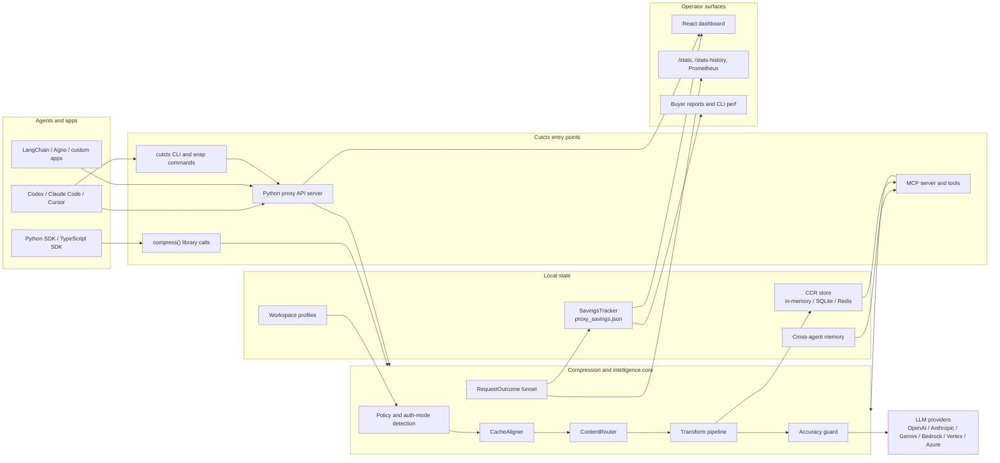
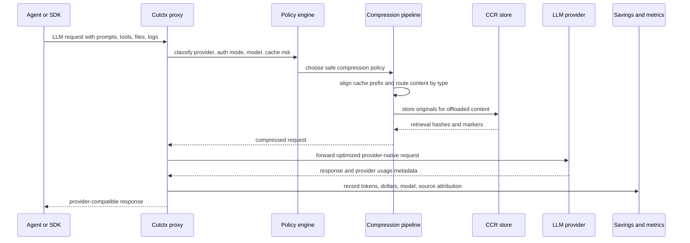
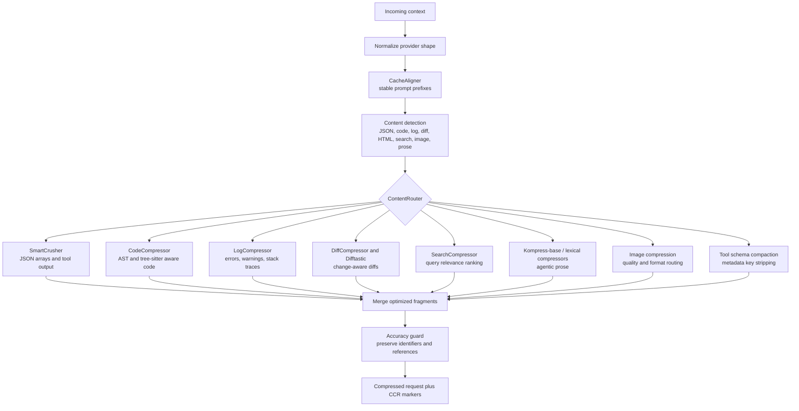
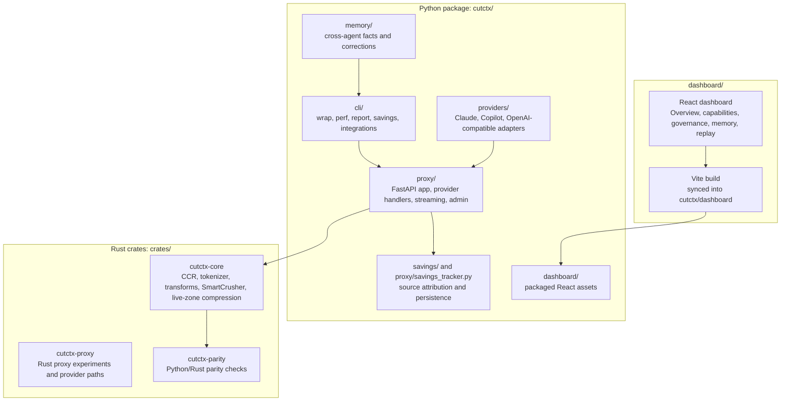
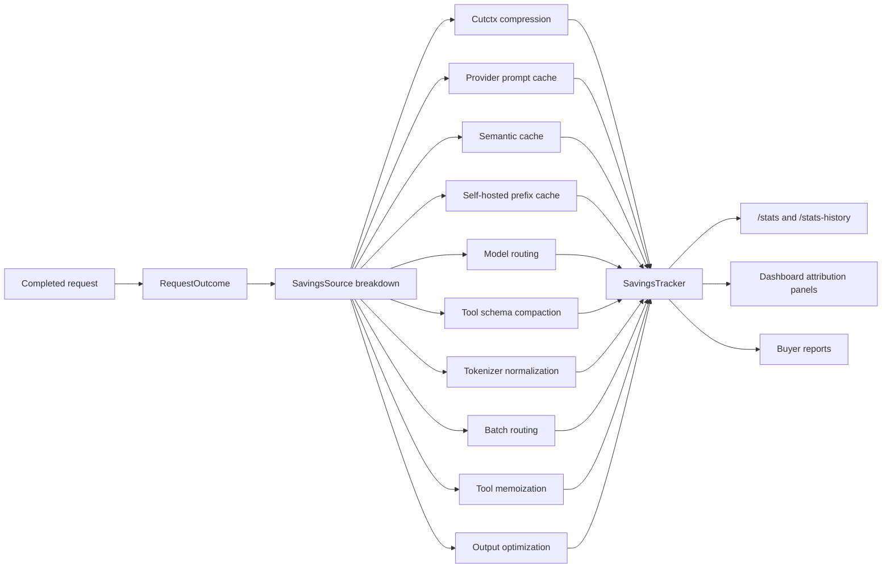
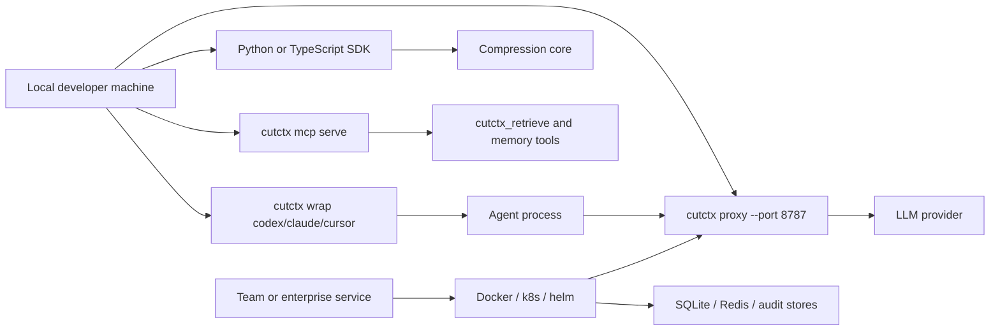

# Cutctx Project Architecture

Cutctx is a local-first context plane for AI agents. It sits between agents and
LLM providers, compresses expensive context before it leaves the machine, keeps
originals retrievable through CCR, tracks savings, and exposes memory,
governance, and observability surfaces for operators.

## System View

## Request Lifecycle

The important design choice is that compression is reversible where it matters:
large or risky drops are replaced by CCR markers, and the original bytes stay in
local storage until the configured TTL expires.

## Compression Pipeline

The pipeline favors specialized transforms over one generic summarizer. That is
why logs, JSON rows, diffs, code, images, and prose have separate algorithms.

## Main Modules

## Tools And Algorithms In Use

| Area | Tools / algorithms | Purpose |
| --- | --- | --- |
| Proxy runtime | FastAPI, provider-native handlers, streaming SSE/WebSocket paths | Intercepts and forwards LLM traffic without client changes. |
| Compression core | ContentRouter, SmartCrusher, CodeCompressor, LogCompressor, DiffCompressor, SearchCompressor, Kompress-base | Chooses a content-specific strategy and removes low-value context. |
| Reversibility | CCR with hash keys, in-memory / SQLite / Redis backends | Stores originals locally and lets agents retrieve exact content later. |
| Token accounting | tiktoken, HuggingFace tokenizers, provider usage metadata | Measures before/after tokens and model-specific costs. |
| Cache optimization | CacheAligner, Anthropic/OpenAI prompt-cache metadata, prefix stability checks | Keeps reusable prefixes stable so provider prompt caches hit. |
| Cost attribution | RequestOutcome funnel, SavingsSource enum, SavingsTracker | Tags savings by source without double-counting. |
| Intelligence | BM25-style relevance, rolling hashes, task-aware policies, workspace profiles | Adjusts compression based on task, recency, repeats, and context budget. |
| Security | LLM firewall regexes, structured-output validation, audit logging, RBAC/entitlements | Governs risky prompts, admin access, and enterprise controls. |
| Observability | React dashboard, `/stats`, `/stats-history`, Prometheus metrics, buyer reports | Shows savings, active compression, model attribution, history, and capability state. |
| Developer stack | Python, Rust, Vite/React, pytest, Playwright specs, Cargo tests | Splits hot compression logic from proxy and dashboard surfaces. |

## Savings Attribution

The attribution path is intentionally centralized. Provider handlers produce a
`RequestOutcome`; the funnel derives one source map; metrics, reports, and the
dashboard consume that same map.

## Deployment Modes

Most individual users run Cutctx locally as a wrapper or proxy. Team and
enterprise deployments can keep the same request lifecycle while adding Redis,
audit stores, SSO/RBAC, and centralized observability.

## What The Project Is About

Cutctx tries to make AI-agent context cheaper and safer without asking every
agent or application to change its prompt code. The product goal is:

1. Reduce tokens before they reach the provider.
2. Preserve accuracy by keeping originals available through CCR.
3. Improve provider cache hit rates instead of accidentally breaking them.
4. Attribute every saving to a concrete source.
5. Share useful memory and learned corrections across agents.
6. Give operators enough dashboard and report data to trust the system.

