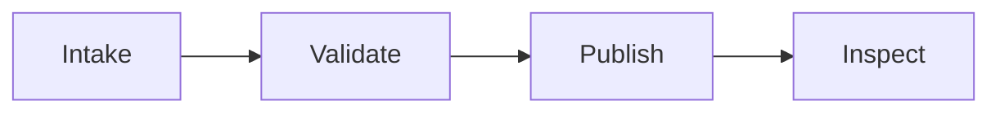

# Publication Spike

This representative fixture is deliberately dense enough to prove that the
manual can carry operational prose, controlled lists, code, and high-signal
tables without relying on a browser or a hosted service.

## Scope and navigation

Use the [diagram source](diagram.mmd) as a renderer-neutral architecture note.
The pilot uses three heading levels so contents extraction has a stable target.

### Acceptance checklist

- [x] Content has semantic headings.
- [x] Tables are rendered as tables rather than monospace text.
- [ ] A human reviews every rasterized page before the style contract is frozen.

> Decision note: a publication build is evidence, not approval. The reviewer
> records layout findings in the visual-QA ledger.

## Wide KPI scorecard

| KPI | Calculation | Target | Warning | Owner | Source | Decision | Anti-gaming guard |
| --- | --- | --- | --- | --- | --- | --- | --- |
| Build success | passing / total builds | >= 98% | < 95% | Release | CI | release gate | count retried failures |
| Change failure | failed changes / changes | < 5% | >= 5% | SRE | incidents | canary halt | include rollback events |
| Evidence freshness | current evidence / expected evidence | 100% | < 95% | Audit | register | audit exit | sample timestamps |
| Accessibility debt | unresolved blockers | 0 | > 0 | UI | scanner + review | release decision | review false negatives |

Source note: pilot values are fictional and demonstrate column wrapping,
repeated table headers, and traceable metric definitions.

## Runbook decision table

| Signal | Owner | Immediate decision | Evidence | Exit condition |
| --- | --- | --- | --- | --- |
| Error budget burn | Incident commander | halt rollout | trace ID, dashboard snapshot | burn returns below threshold |
| Migration lock timeout | Database lead | roll forward or restore | query plan, lock graph | integrity checks pass |
| Auth regression | Security lead | revoke release | affected session sample | negative test is clean |

:::pagebreak

# Automation specimen

## Shell verification

```shell
rtk pytest engineering-handbook/automation/tests -q
```

## Python evaluator

```python
def release_gate(success_rate: float, evidence_fresh: bool) -> bool:
    return success_rate >= 0.98 and evidence_fresh
```

## TypeScript browser assertion

```typescript
await expect(page.getByRole('heading', { name: 'Release status' })).toBeVisible();
```

## SQL migration guard

```sql
SELECT count(*) AS invalid_rows FROM invoices WHERE account_id IS NULL;
```

## YAML automation policy

```yaml
release:
  canary_percent: 10
  abort_on_error_budget_burn: true
```

## JSON evidence packet

```json
{"release":"2026.1.0","approved":true,"evidence_level":"E3"}
```

## Mermaid control flow



:::volumebreak

# Volume transition

This explicit transition checks that volume-level breaks do not strand a heading
at the bottom of a page. A real chapter continues with a fuller procedure,
worked example, and reusable report template.
