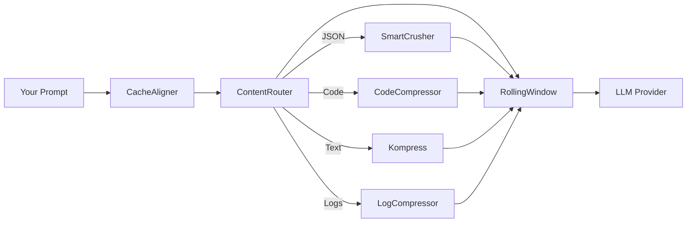

# Cutctx

<div class="hero" markdown>

**The Context Optimization Layer for LLM Applications**

Compress everything your AI agent reads. Same answers, fraction of the tokens.

</div>

<div class="badges" markdown>

[](https://pypi.org/project/cutctx-ai/)
[](https://pypi.org/project/cutctx-ai/)
[](https://github.com/cutctx/cutctx/blob/main/LICENSE)
[](https://discord.gg/yRmaUNpsPJ)

</div>

<div class="stats-bar" markdown>

<div class="stat">
<span class="number">87%</span>
<span class="label">Avg Token Reduction</span>
</div>
<div class="stat">
<span class="number">100%</span>
<span class="label">Answer Accuracy</span>
</div>
<div class="stat">
<span class="number">9+</span>
<span class="label">Content Compressors</span>
</div>
<div class="stat">
<span class="number">100+</span>
<span class="label">LLM Providers</span>
</div>

</div>

---

## What It Does

Every tool call, DB query, file read, and RAG retrieval your agent makes is 70-95% boilerplate. Cutctx compresses it away before it hits the model. The LLM sees less noise, responds faster, and costs less.

```
Your Agent / App
    │
    │  tool outputs, logs, DB reads, RAG results, file reads, API responses
    ▼
 Cutctx  ← proxy, Python library, or framework integration
    │
    ▼
 LLM Provider  (OpenAI, Anthropic, Google, Bedrock, 100+ via LiteLLM)
```

Cutctx works as a **transparent proxy** (zero code changes), a **Python function** (`compress()`), or a **framework integration** (LangChain, Agno, Strands, LiteLLM, MCP).

---

## Quick Start

=== "Proxy (Zero Code Changes)"

    ```bash
    pip install "cutctx-ai[all]"
    cutctx proxy
    ```

    ```bash
    # Point any tool at the proxy
    ANTHROPIC_BASE_URL=http://localhost:8787 claude
    OPENAI_BASE_URL=http://localhost:8787/v1 your-app
    ```

    That's it. Your existing code works unchanged, with 40-90% fewer tokens.

    Want an always-on local runtime instead? See [Persistent Installs &rarr;](persistent-installs.md).

=== "Python SDK"

    ```python
    from cutctx import compress

    result = compress(messages, model="claude-sonnet-4-5-20250929")
    response = client.messages.create(
        model="claude-sonnet-4-5-20250929",
        messages=result.messages,
    )
    print(f"Saved {result.tokens_saved} tokens ({result.compression_ratio:.0%})")
    ```

    Works with any Python LLM client. [Full SDK guide &rarr;](sdk.md)

=== "Coding Agents"

    ```bash
    cutctx wrap claude       # Claude Code
    cutctx wrap copilot      # GitHub Copilot CLI
    cutctx wrap codex        # OpenAI Codex CLI
    cutctx wrap aider        # Aider
    cutctx wrap cursor       # Cursor
    cutctx wrap windsurf     # Windsurf
    cutctx wrap zed          # Zed
    cutctx wrap openclaw     # OpenClaw plugin bootstrap
    ```

    Starts the proxy, points your tool at it, compresses everything automatically.

    If you prefer an always-on proxy that `wrap` can reuse or recover, see [Persistent Installs &rarr;](persistent-installs.md).

=== "TypeScript SDK"

    ```typescript
    import { compress } from 'cutctx-ai';

    const result = await compress(messages, { model: 'claude-sonnet-4-5-20250929' });
    // Use result.messages with any LLM client
    console.log(`Saved ${result.tokensSaved} tokens`);
    ```

    Works with Vercel AI SDK, OpenAI Node SDK, and Anthropic TS SDK. [Full TS guide &rarr;](typescript-sdk.md)

=== "LiteLLM Callback"

    ```python
    import litellm
    from cutctx.integrations.litellm_callback import CutctxCallback

    litellm.callbacks = [CutctxCallback()]
    # All 100+ providers now compressed automatically
    ```

---

## Framework Integrations

<div class="grid-container" markdown>

<div class="grid-item" markdown>

### LangChain

Wrap any chat model. Supports memory, retrievers, tools, streaming, async.

```python
from cutctx.integrations import CutctxChatModel

llm = CutctxChatModel(ChatOpenAI(model="gpt-4o"))
```

[LangChain Guide &rarr;](langchain.md)

</div>

<div class="grid-item" markdown>

### Agno

Full agent framework integration with observability hooks.

```python
from cutctx.integrations.agno import CutctxAgnoModel

model = CutctxAgnoModel(Claude(id="claude-sonnet-4-20250514"))
agent = Agent(model=model)
```

[Agno Guide &rarr;](agno.md)

</div>

<div class="grid-item" markdown>

### Strands

Model wrapping + tool output hook provider for Strands Agents.

```python
from cutctx.integrations.strands import CutctxStrandsModel

model = CutctxStrandsModel(wrapped_model=bedrock_model)
agent = Agent(model=model)
```

[Strands Guide &rarr;](strands.md)

</div>

<div class="grid-item" markdown>

### MCP Tools

Three tools for Claude Code, Cursor, or any MCP client: `cutctx_compress`, `cutctx_retrieve`, `cutctx_stats`.

```bash
cutctx mcp install && claude
```

[MCP Guide &rarr;](mcp.md)

</div>

<div class="grid-item" markdown>

### TypeScript SDK

`compress()`, Vercel AI SDK middleware, OpenAI and Anthropic client wrappers.

```bash
npm install cutctx-ai
```

[TypeScript SDK Guide &rarr;](typescript-sdk.md)

</div>

<div class="grid-item" markdown>

### OpenClaw

ContextEngine plugin for OpenClaw agents. Auto-compresses context in `assemble()`.

```bash
cutctx wrap openclaw
```

[OpenClaw Plugin &rarr;](https://github.com/cutctx/cutctx/tree/main/plugins/openclaw)

</div>

</div>

[All integration patterns &rarr;](integration-guide.md){ .md-button }

---

## How It Works

Cutctx runs a three-stage pipeline on every request:



**Stage 1: CacheAligner** — Stabilizes message prefixes so the provider's KV cache actually hits. Claude offers a 90% read discount on cached prefixes; CacheAligner makes that work.

**Stage 2: ContentRouter** — Auto-detects content type (JSON, code, logs, search results, diffs, HTML, plain text) and routes each to the optimal compressor:

| Content Type | Compressor | How It Works |
|-------------|-----------|-------------|
| JSON arrays | **SmartCrusher** | Statistical analysis: keeps errors, anomalies, boundaries. No hardcoded rules. |
| Source code | **CodeCompressor** | AST-aware (tree-sitter). Preserves function signatures, collapses bodies. |
| Plain text | **Kompress** | ModernBERT token classification. Removes redundant tokens while preserving meaning. |
| Build/test logs | **LogCompressor** | Keeps failures, errors, warnings. Drops passing noise. |
| Search results | **SearchCompressor** | Ranks by relevance to user query, keeps top matches. |
| Git diffs | **DiffCompressor** / Difftastic | Preserves change hunks or AST-aware structural diffs via [`--difftastic`](difftastic.md). |
| Repetitive logs | **Drain3LogCompressor** | ML template mining via [`--drain3`](drain3.md). Groups repetitive lines by structural template. |
| File reads / code queries | **GraphifyInterceptor** | Knowledge-graph subgraph via [`--knowledge-graph`](knowledge-graph.md). ~15 tokens/node vs ~800 tokens/file. |
| HTML | **HTMLExtractor** | Strips markup, extracts readable content. |

**Stage 3: RollingWindow** — If the conversation still exceeds the model's context limit, drops the oldest messages to strictly enforce the token budget.

**Nothing is lost.** Compressed content goes into the CCR store (Compress-Cache-Retrieve). The LLM gets a `cutctx_retrieve` tool and can fetch full originals when it needs more detail.

[Full architecture deep dive &rarr;](ARCHITECTURE.md)

---

## Results

**100 production log entries. One critical error buried at position 67.**

| Metric | Baseline | Cutctx |
|--------|----------|----------|
| Input tokens | 10,144 | 1,260 |
| Correct answers | **4/4** | **4/4** |

**87.6% fewer tokens. Same answer.** The FATAL error was automatically preserved — not by keyword matching, but by statistical analysis of field variance.

### Real Workloads

| Scenario | Before | After | Savings |
|----------|--------|-------|---------|
| Code search (100 results) | 17,765 | 1,408 | **92%** |
| SRE incident debugging | 65,694 | 5,118 | **92%** |
| Codebase exploration | 78,502 | 41,254 | **47%** |
| GitHub issue triage | 54,174 | 14,761 | **73%** |

### Accuracy Benchmarks

| Benchmark | Category | N | Accuracy | Compression |
|-----------|----------|---|----------|-------------|
| GSM8K | Math | 100 | 0.870 | 0.000 delta |
| TruthfulQA | Factual | 100 | 0.560 | +0.030 delta |
| SQuAD v2 | QA | 100 | **97%** | 19% reduction |
| BFCL | Tool/Function | 100 | **97%** | 32% reduction |
| CCR Needle | Lossless | 50 | **100%** | 77% reduction |

[Full benchmark methodology &rarr;](benchmarks.md) | [Known limitations &rarr;](LIMITATIONS.md)

---

## Key Features

<div class="grid-container" markdown>

<div class="grid-item" markdown>
### Lossless Compression (CCR)
Compresses aggressively, stores originals, gives the LLM a tool to retrieve full details. Nothing is thrown away.
[Learn more &rarr;](ccr.md)
</div>

<div class="grid-item" markdown>
### Smart Content Detection
Auto-detects JSON, code, logs, text, diffs, HTML. Routes each to the best compressor. Zero configuration needed.
[Learn more &rarr;](compression.md)
</div>

<div class="grid-item" markdown>
### Cache Optimization
Stabilizes prefixes so provider KV caches hit. Tracks frozen messages to preserve the 90% read discount.
[Learn more &rarr;](ccr.md)
</div>

<div class="grid-item" markdown>
### Image Compression
40-90% token reduction via trained ML router. Automatically selects resize/quality tradeoff per image.
[Learn more &rarr;](image-compression.md)
</div>

<div class="grid-item" markdown>
### Persistent Memory
Hierarchical memory (user/session/agent/turn) with USearch / SQLite + HNSW backends. Survives across conversations.
[Memory guide &rarr;](memory.md) · [USearch backend &rarr;](usearch.md)
</div>

<div class="grid-item" markdown>
### Failure Learning
Reads past sessions, finds failed tool calls, correlates with what succeeded, writes learnings to CLAUDE.md.
[Learn more &rarr;](learn.md)
</div>

<div class="grid-item" markdown>
### Multi-Agent Context
Compress what moves between agents. Any framework.
```python
ctx = SharedContext()
ctx.put("research", big_output)
summary = ctx.get("research")  # ~80% smaller
```
[Learn more &rarr;](shared-context.md)
</div>

<div class="grid-item" markdown>
### Metrics & Observability
Prometheus endpoint, per-request logging, cost tracking, budget limits, pipeline timing breakdowns.
[Learn more &rarr;](metrics.md)
</div>

<div class="grid-item" markdown>
### ML Log Template Mining (Drain3)
ML clustering of repetitive log lines. 10–50× reduction on server/application logs vs the statistical sampler's 2–5×.
[Learn more &rarr;](drain3.md)
</div>

<div class="grid-item" markdown>
### Knowledge Graph Compression
Codebase-wide semantic graph via Tree-sitter + NetworkX. BFS subgraphs replace file reads with ~15-token node summaries.
[Learn more &rarr;](knowledge-graph.md)
</div>

<div class="grid-item" markdown>
### Stack Graphs Code Navigation
Deterministic cross-file go-to-definition via tree-sitter-stack-graphs. Exact symbol resolution without ML or embeddings. Supports Python, JS/TS.
[Learn more &rarr;](stack-graphs.md)
</div>

<div class="grid-item" markdown>
### Structural Diff (Difftastic)
AST-aware git diff compression. Moved code = 0 lines, whitespace ignored, 60–95% reduction on large refactors.
[Learn more &rarr;](difftastic.md)
</div>

</div>

---

## Cloud Providers

Works with any LLM provider out of the box:

```bash
cutctx proxy                                          # Direct Anthropic/OpenAI
cutctx proxy --backend bedrock --region us-east-1     # AWS Bedrock
cutctx proxy --backend vertex_ai --region us-central1 # Google Vertex AI
cutctx proxy --backend azure                          # Azure OpenAI
cutctx proxy --backend openrouter                     # OpenRouter (400+ models)
```

Or via LiteLLM for 100+ providers (Together, Groq, Fireworks, Ollama, vLLM, etc.).

---

## Installation

```bash
pip install cutctx-ai                # Core library (Python)
pip install "cutctx-ai[all]"         # Broad bundle (heavy/proprietary extras omitted)
npm install cutctx-ai                # TypeScript / Node.js
pip install "cutctx-ai[proxy]"       # Proxy server + MCP tools
pip install "cutctx-ai[ml]"          # ML compression (Kompress, requires torch)
pip install "cutctx-ai[langchain]"   # LangChain integration
pip install "cutctx-ai[agno]"        # Agno integration
pip install "cutctx-ai[evals]"       # Evaluation framework
pip install usearch                  # USearch vector backend (also in [memory])
```

Requires Python 3.10+.

---

## Next Steps

- **[Quickstart](quickstart.md)** — Running in 5 minutes
- **[Integration Guide](integration-guide.md)** — Every way to add Cutctx to your stack
- **[Architecture](ARCHITECTURE.md)** — How the pipeline works under the hood
- **[Benchmarks](benchmarks.md)** — Accuracy and latency data
- **[Limitations](LIMITATIONS.md)** — When compression helps and when it doesn't
- **[Filesystem Contract](filesystem-contract.md)** — Canonical config/workspace env vars and paths

---

Apache 2.0 — Free for commercial use. [GitHub](https://github.com/cutctx/cutctx) | [PyPI](https://pypi.org/project/cutctx-ai/) | [Discord](https://discord.gg/yRmaUNpsPJ)
